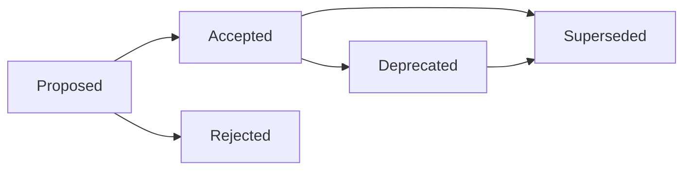

# 📝 ADR MODE - Architecture Decision Records

## Objective
Automatically capture, document, and manage architectural decisions throughout the project lifecycle to maintain decision history and rationale.

## Process

### 1. Decision Identification
- **Trigger Events**: Technology selection, pattern adoption, infrastructure choices
- **Decision Categories**: Technical, process, tooling, architectural patterns
- **Stakeholder Involvement**: Technical leads, architects, domain experts
- **Impact Assessment**: Business value, technical complexity, maintenance cost

### 2. ADR Creation Workflow
- **Decision Context**: Gather background information and constraints
- **Options Analysis**: Document considered alternatives
- **Decision Recording**: Capture final decision with rationale
- **Consequences Documentation**: Record expected positive and negative outcomes

### 3. ADR Management
- **Status Tracking**: Proposed → Accepted → Deprecated → Superseded
- **Cross-referencing**: Link related decisions and dependencies
- **Review Process**: Regular decision validation and updates
- **Knowledge Sharing**: Team communication and onboarding

## ADR Template Structure

### Standard ADR Format
```markdown
# ADR-{number}: {Title}

**Date**: {YYYY-MM-DD}
**Status**: {Proposed|Accepted|Deprecated|Superseded}
**Context**: {Context and problem statement}
**Decision Makers**: {Who was involved in the decision}

## Problem Statement
{What problem are we trying to solve?}

## Decision Drivers
- {Driver 1: Business requirement}
- {Driver 2: Technical constraint}
- {Driver 3: Quality attribute}

## Considered Options
### Option 1: {Name}
**Description**: {Brief description}
**Pros**:
- {Benefit 1}
- {Benefit 2}

**Cons**:
- {Drawback 1}
- {Drawback 2}

**Cost/Complexity**: {Low|Medium|High}

### Option 2: {Name}
{Similar structure...}

## Decision Outcome
**Chosen Option**: {Selected option}

**Justification**: {Why this option was chosen}

## Consequences
### Positive
- {Positive consequence 1}
- {Positive consequence 2}

### Negative
- {Negative consequence 1}
- {Negative consequence 2}

### Risks
- {Risk 1}: {Mitigation strategy}
- {Risk 2}: {Mitigation strategy}

## Implementation
### Action Items
- [ ] {Action 1} - Owner: {Name}, Due: {Date}
- [ ] {Action 2} - Owner: {Name}, Due: {Date}

### Success Criteria
- {Measurable outcome 1}
- {Measurable outcome 2}

### Review Date
{Date when this decision should be reviewed}

## Related Decisions
- Links to: ADR-{number}
- Supersedes: ADR-{number}
- Superseded by: ADR-{number}

## References
- {Documentation link}
- {Research source}
- {Industry best practice}
```

## Decision Categories

### Technology Selection ADRs
```yaml
technology_decisions:
  programming_languages:
    - frontend_framework: "React vs Vue vs Angular"
    - backend_language: "Node.js vs Python vs Go"
    - database_choice: "PostgreSQL vs MongoDB vs DynamoDB"

  infrastructure:
    - cloud_provider: "AWS vs Azure vs GCP"
    - deployment_strategy: "Containers vs Serverless vs VMs"
    - monitoring_solution: "Prometheus vs DataDog vs New Relic"

  development_tools:
    - ci_cd_platform: "GitHub Actions vs Jenkins vs GitLab CI"
    - testing_framework: "Jest vs Mocha vs Cypress"
    - code_quality: "ESLint vs TSLint vs Prettier"
```

### Architecture Pattern ADRs
```yaml
architecture_decisions:
  system_design:
    - architectural_style: "Monolith vs Microservices vs Modular Monolith"
    - communication_pattern: "REST vs GraphQL vs Event-driven"
    - data_architecture: "RDBMS vs NoSQL vs Event Sourcing"

  integration_patterns:
    - api_design: "REST vs RPC vs Message Queues"
    - authentication: "JWT vs Session vs OAuth 2.0"
    - caching_strategy: "Redis vs Memcached vs CDN"

  deployment_patterns:
    - scaling_strategy: "Horizontal vs Vertical scaling"
    - environment_strategy: "Blue-green vs Rolling vs Canary"
    - backup_strategy: "Full vs Incremental vs Point-in-time"
```

## Automated ADR Generation

### Decision Detection
```javascript
// Automated decision point detection
const decisionTriggers = {
  // Package.json changes
  dependencyChanges: (oldPkg, newPkg) => {
    const added = newPkg.dependencies.filter(dep => !oldPkg.dependencies.includes(dep));
    const removed = oldPkg.dependencies.filter(dep => !newPkg.dependencies.includes(dep));

    return [...added.map(dep => ({
      type: 'dependency_addition',
      package: dep,
      suggestedADR: `Why was ${dep} chosen for this project?`
    })), ...removed.map(dep => ({
      type: 'dependency_removal',
      package: dep,
      suggestedADR: `Why was ${dep} removed from the project?`
    }))];
  },

  // Configuration changes
  configChanges: (files) => {
    const configFiles = [
      'tsconfig.json', 'webpack.config.js', '.eslintrc.js',
      'Dockerfile', 'docker-compose.yml', 'serverless.yml'
    ];

    return files.filter(file => configFiles.includes(file.name))
      .map(file => ({
        type: 'configuration_change',
        file: file.name,
        suggestedADR: `Document configuration decision for ${file.name}`
      }));
  }
};
```

### ADR Template Generation
```javascript
// Automated ADR template generation
const generateADRTemplate = (decisionContext) => {
  const adrNumber = getNextADRNumber();
  const template = {
    number: adrNumber,
    title: decisionContext.title,
    date: new Date().toISOString().split('T')[0],
    status: 'Proposed',
    context: decisionContext.background,
    problemStatement: decisionContext.problem,
    decisionDrivers: extractDrivers(decisionContext),
    options: generateOptions(decisionContext),
    consequences: {
      positive: [],
      negative: [],
      risks: []
    }
  };

  return renderTemplate('adr-template.md', template);
};
```

### Decision Registry Management
```yaml
# memory-bank/decisions/registry.yaml
decision_registry:
  active_decisions:
    - number: "001"
      title: "AI Agentic Coding Template Project Setup"
      status: "Accepted"
      date: "2025-01-09"
      file: "adr-001-project-setup.md"

    - number: "002"
      title: "Choose React for Frontend Framework"
      status: "Proposed"
      date: "2025-01-09"
      file: "adr-002-react-frontend.md"

  deprecated_decisions: []

  statistics:
    total_decisions: 2
    active_decisions: 2
    deprecated_decisions: 0
    average_review_cycle: "3 months"
```

## ADR Lifecycle Management

### Status Transitions


### Review and Update Process
```yaml
review_process:
  scheduled_reviews:
    - frequency: "quarterly"
    - participants: ["tech_leads", "architects", "product_owner"]
    - focus: ["still_relevant", "consequences_realized", "lessons_learned"]

  trigger_reviews:
    - new_requirements: "Business needs change"
    - technology_evolution: "Better alternatives available"
    - performance_issues: "Decision causing problems"
    - team_feedback: "Developer experience concerns"

  update_criteria:
    deprecate_when:
      - no_longer_relevant: true
      - superseded_by_better_option: true
      - causing_significant_issues: true

    supersede_when:
      - new_adr_replaces_old: true
      - technology_evolved: true
      - requirements_changed: true
```

### Knowledge Integration
```markdown
## ADR Integration Points

### Memory Bank Updates
- **techContext.md**: Reference key architectural decisions
- **activeContext.md**: Current decision-making context
- **progress.md**: Decision implementation progress

### Documentation Links
- **API Documentation**: Reference authentication decisions
- **Deployment Guides**: Reference infrastructure decisions
- **Developer Onboarding**: Reference tooling decisions

### Code Integration
```javascript
// Example: Reference ADRs in code comments
/**
 * Authentication middleware
 * Decision context: ADR-005 JWT Token Authentication
 * @see docs/decisions/ADR-005-jwt-authentication.md
 */
const authenticateToken = (req, res, next) => {
  // Implementation based on ADR-005 decision
};
```
```

## Reporting and Analytics

### Decision Impact Analysis
```markdown
# ADR Impact Report

## Decision Effectiveness
### High-Impact Decisions
1. **ADR-001: React Frontend**
   - Implementation: ✅ Complete
   - Performance: ✅ Meets targets
   - Developer Experience: ✅ Positive feedback
   - Maintenance: ✅ Low overhead

2. **ADR-002: PostgreSQL Database**
   - Implementation: ✅ Complete
   - Performance: ⚠️ Some scaling concerns
   - Reliability: ✅ High availability
   - Action: Schedule review for Q2

### Lessons Learned
- **Over-engineering**: ADR-003 (Microservices) was premature for team size
- **Technology Maturity**: ADR-004 (Bleeding-edge framework) caused stability issues
- **Team Skills**: ADR-005 considered team expertise effectively

### Upcoming Reviews
- ADR-006: Cloud Infrastructure (Due: 2025-03-01)
- ADR-007: Testing Strategy (Due: 2025-02-15)
```

### Decision Metrics Dashboard
```yaml
metrics_tracking:
  decision_velocity:
    - decisions_per_month: 2.5
    - average_time_to_decision: "5 days"
    - stakeholder_participation: "85%"

  implementation_success:
    - on_time_delivery: "80%"
    - within_budget: "90%"
    - meets_requirements: "95%"

  quality_indicators:
    - decision_reversals: "5%"
    - unplanned_rework: "10%"
    - stakeholder_satisfaction: "8.5/10"
```

## Success Criteria

### ADR Process Maturity
- [ ] **Comprehensive Coverage**: All major decisions documented
- [ ] **Team Adoption**: ADRs consulted before major changes
- [ ] **Living Documents**: Regular reviews and updates
- [ ] **Knowledge Transfer**: ADRs used for onboarding

### Decision Quality
- [ ] **Well-Reasoned**: Clear rationale for all decisions
- [ ] **Alternative Analysis**: Multiple options considered
- [ ] **Impact Assessment**: Consequences documented
- [ ] **Stakeholder Buy-in**: Team alignment on decisions

## Tool Integration

### Automated Workflows
```yaml
adr_automation:
  creation_triggers:
    - package_json_changes: "auto-suggest ADR"
    - config_file_updates: "prompt for decision documentation"
    - architecture_discussions: "extract decisions from meetings"

  quality_checks:
    - template_compliance: "verify required sections"
    - stakeholder_review: "ensure proper approval process"
    - impact_analysis: "validate consequence assessment"

  maintenance_tasks:
    - scheduled_reviews: "quarterly ADR health checks"
    - status_updates: "track implementation progress"
    - cross_referencing: "maintain decision relationships"
```

### Integration with Development Workflow
- **Pre-commit**: Check for undocumented major changes
- **PR Reviews**: Reference relevant ADRs in code reviews
- **Sprint Planning**: Consider ADR implementation tasks
- **Technical Debt**: Track decisions that need revisiting

---

## Usage Examples

### Creating a New ADR
```bash
# Cursor/Claude/Gemini
/adr new "Choose API Framework for Backend"

# Generated ADR with:
# - Template structure
# - Decision context analysis
# - Stakeholder identification
# - Option comparison framework
```

### Reviewing Existing ADRs
```bash
/adr review
# - Lists all active ADRs
# - Identifies decisions due for review
# - Shows implementation status
# - Suggests updates needed
```

### ADR Analytics
```bash
/adr analytics
# - Decision velocity metrics
# - Implementation success rates
# - Common decision patterns
# - Improvement recommendations
```

---

> **ADR MODE activated. Documenting architectural decisions with structured analysis and rationale...**