# ⚠️ MANDATORY TEMPLATE ENFORCEMENT RULES

## 🚨 CRITICAL: These Rules Are NOT Optional

All AI assistants (Cursor, Claude Code, Gemini CLI) MUST follow these template enforcement rules. **Failure to comply will result in command blocking.**

## Enforcement Mechanism

### Pre-Command Check
Before executing any workflow command (`/van`, `/plan`, `/adr`, `/creative`, `/design-validator`, `/implement`, `/reflect`):
1. **VERIFY** template exists in `.ai/template/outputs/[command]/`
2. **LOAD** the template - DO NOT create ad-hoc documents
3. **PREPARE** to fill all mandatory fields

### During Command Execution
1. **USE** the template - no exceptions
2. **FILL** all `{{variables}}` with actual data
3. **VALIDATE** no placeholders remain unfilled
4. **SAVE** to designated `memory-bank/` location only

### Post-Command Validation
1. **CHECK** output matches template structure
2. **VERIFY** file saved to correct location
3. **CONFIRM** frontmatter is present
4. **REPORT** successful generation

## 🛑 Blocking Conditions

The following will **BLOCK** command execution:

### 1. Missing Template
```
❌ BLOCKED: Template not found
   Command: /van
   Missing: .ai/template/outputs/van/requirements-spec.md
   Action: Cannot proceed without template
```

### 2. Wrong Output Location
```
❌ BLOCKED: Output not in memory-bank
   Command: /creative
   Invalid: ./architecture.md
   Required: memory-bank/designs/architecture/architecture-v1.0.0.md
```

### 3. Template Not Used
```
❌ BLOCKED: Output doesn't match template structure
   Command: /adr
   Issue: Missing required sections and frontmatter
   Required: Use .ai/template/outputs/adr/adr-template.md
```

### 4. Unfilled Variables
```
❌ BLOCKED: Template variables not filled
   Command: /plan
   Unfilled: {{epic_id}}, {{epic_name}}
   Required: All variables must be replaced with actual values
```

## ✅ Correct Execution Example

### Command: `/van`

```yaml
Step 1: Load Template
  File: .ai/template/outputs/van/requirements-spec.md
  Status: ✅ Loaded

Step 2: Fill Variables
  {{project_name}}: "E-commerce Platform"
  {{problem_statement}}: "Need scalable online store"
  {{business_goals}}: ["Increase sales", "Improve UX"]
  Status: ✅ All variables filled

Step 3: Generate Output
  Content: [Fully rendered template]
  Status: ✅ No placeholders remaining

Step 4: Save to Memory Bank
  Location: memory-bank/requirements/requirements-2024-01-12T10-30-00Z.md
  Status: ✅ File created

Step 5: Validation
  - Has frontmatter: ✅
  - Matches structure: ✅
  - Correct location: ✅
  Status: ✅ PASSED
```

## 📊 Enforcement Metrics

The system tracks:
- **Template Usage Rate**: Must be 100% for workflow commands
- **Validation Success Rate**: Target >95%
- **Violation Count**: Should be 0
- **Enforcement Log**: `memory-bank/.enforcement.log`

## 🔒 No Exemptions for Workflow Commands

These commands **MUST** use templates:
- `/van` - Requirements analysis
- `/plan` - Task planning
- `/adr` - Architecture decisions
- `/creative` - Architecture design
- `/design-validator` - Design validation
- `/implement` - Implementation guide
- `/reflect` - Progress report

## 🚦 Enforcement Workflow

```mermaid
graph TD
    A[Command Triggered] --> B{Is Workflow Command?}
    B -->|No| C[Execute Normally]
    B -->|Yes| D[Load Template]
    D --> E{Template Exists?}
    E -->|No| F[❌ BLOCK: Missing Template]
    E -->|Yes| G[Fill Template Variables]
    G --> H{All Variables Filled?}
    H -->|No| I[❌ BLOCK: Unfilled Variables]
    H -->|Yes| J[Generate Output]
    J --> K[Save to Memory Bank]
    K --> L{Correct Location?}
    L -->|No| M[❌ BLOCK: Wrong Location]
    L -->|Yes| N[Validate Structure]
    N --> O{Matches Template?}
    O -->|No| P[❌ BLOCK: Template Not Used]
    O -->|Yes| Q[✅ SUCCESS]
```



## 💡 Key Points to Remember

1. **Templates are mandatory**, not suggestions
2. **Memory-bank is the only valid output location**
3. **All variables must be filled** - no `{{placeholder}}` in output
4. **Structure must match template** - same headings and sections
5. **Frontmatter is required** - includes command, phase, version, timestamp

## 🎯 Compliance Checklist

Before marking any workflow command as complete:

- [ ] Template was loaded from `.ai/template/outputs/`
- [ ] All mandatory fields were filled
- [ ] No `{{variables}}` remain in output
- [ ] Output saved to `memory-bank/` correct subdirectory
- [ ] File naming follows convention (timestamp/version/slug)
- [ ] Frontmatter is present and complete
- [ ] Document structure matches template
- [ ] Enforcement log shows SUCCESS

## ⚡ Quick Reference

| Command | Template | Output Location |
|---------|----------|-----------------|
| `/van` | `outputs/van/requirements-spec.md` | `memory-bank/requirements/` |
| `/plan` | `outputs/plan/tasks.md` | `memory-bank/tasks.md` |
| `/adr` | `outputs/adr/adr-template.md` | `memory-bank/decisions/` |
| `/creative` | `outputs/creative/architecture-design.md` | `memory-bank/designs/architecture/` |
| `/design-validator` | `outputs/design-validator/validation-report.md` | `memory-bank/validation/` |
| `/implement` | `outputs/implement/implementation-guide.md` | `memory-bank/implementation/` |
| `/reflect` | `outputs/reflect/progress-report.md` | `memory-bank/progress.md` |

---

**⚠️ FINAL WARNING**: Non-compliance with these rules will result in command failure. The enforcement system is automated and will block execution if rules are not followed.