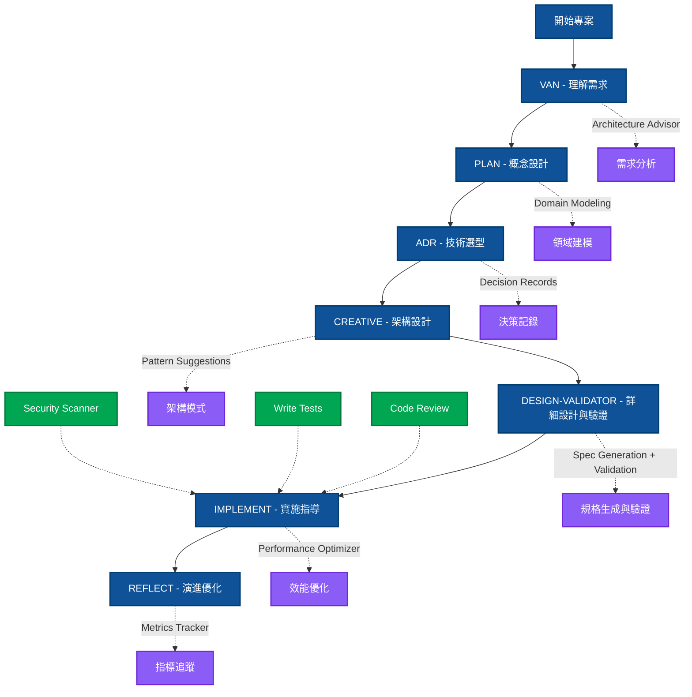
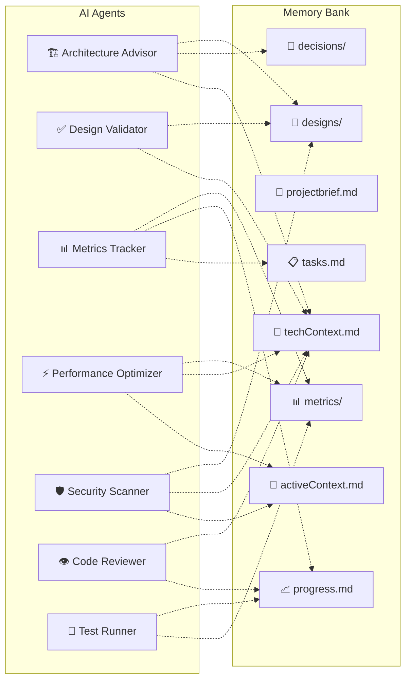

# 🤖 Universal AI Workflow Guide - Level 4 創新期

> 統一多種 AI Copilot 的專業開發工作流程 - 7大智能代理系統完整覆蓋

---

## 🚀 Quick Start

### 1. 初始化設置

```bash
# 安裝依賴
npm install

# 生成 AI 工具配置
npm run ai-sync
```

### 2. 生成配置

所有工具配置將從 `.ai/template/` 自動生成：
- Cursor: `.cursorrules` + `.cursor/`
- Claude Code: `CLAUDE.md` + `.claude/`
- Gemini CLI: `GEMINI.md` + `.gemini/`

### 3. 開始工作流程

| AI 工具 | 初始化命令 | 說明 |
|---------|------------|------|
| **Cursor** | `/van` | Slash command |
| **Claude Code** | `/van` | Slash command |
| **Gemini CLI** | `/van` | Slash command |

---

## 🧠 Level 4 智能代理生態系統

### 核心 AI 代理 (7個)

| 代理 | 核心功能 | 自動化程度 | 觸發時機 |
|------|----------|-----------|----------|
| 🏗️ **Architecture Advisor** | 架構建議和技術選型 | 85% | `/plan`, `/creative` |
| ✅ **Design Validator** | 設計驗證和規格生成 | 95% | `/design-validator`, `/creative` |
| 📊 **Metrics Tracker** | 開發指標和質量閘門 | 90% | 持續運行 |
| ⚡ **Performance Optimizer** | 效能監控和優化 | 85% | `/implement`, `/reflect` |
| 🛡️ **Security Scanner** | 安全掃描和合規 | 95% | `/implement`, 自動觸發 |
| 👁️ **Code Reviewer** | 代碼審查和品質控制 | 80% | `/review-code`, PR 觸發 |
| 🧪 **Test Runner** | 自動化測試執行 | 90% | `/implement`, 代碼變更 |

---

## 📚 完整指令索引

### 🔄 架構設計核心指令

| 指令 | 步驟 | 階段 | AI 增強 | 主要交付物 |
|------|------|------|---------|------------|
| `/van` | 1️⃣ | 理解需求 | Architecture Advisor | Memory Bank, 需求規格 |
| `/plan` | 2️⃣ | 概念設計 | 領域建模 | tasks.md, WBS |
| `/adr` | 3️⃣ | 技術選型 | 決策記錄自動化 | ADR 文檔 |
| `/creative` | 4️⃣ | 架構設計 | 架構模式 | 系統架構, API 設計 |
| `/design-validator` | 5️⃣ | 詳細設計與驗證 | 規格生成+驗證 | OpenAPI, Schema, 驗證報告 |
| `/implement` | 6️⃣ | 實施指導 | Performance Optimizer | 程式碼, 測試 |
| `/reflect` | 7️⃣ | 演進優化 | Metrics Tracker | 進度報告, 改進建議 |

### 🛠️ 智能輔助指令 (Utility)

| 指令 | 功能 | AI 代理 | 輸出 |
|------|------|---------|------|
| `/adr` | 架構決策記錄 | ADR 自動化 | 決策文檔, 影響分析 |
| `/design-validator` | 設計驗證 | Design Validator | 驗證報告, 自動生成規格 |
| `/task-next` | PM 建議 | Task Advisor | 下一步行動建議 |
| `/debug` | 智能除錯 | Debug Assistant | 根因分析, 解決方案 |
| `/review-code` | 代碼審查 | Code Reviewer | 審查報告, 改進項目 |
| `/write-tests` | 測試撰寫 | Test Runner | 測試案例, 覆蓋率報告 |

### ⚙️ 系統管理指令 (System)

| 指令 | 功能 | 說明 |
|------|------|------|
| `/commit` | Git 提交 | 生成 Conventional commit message |
| `/resume` | 恢復上下文 | 從 Memory Bank 恢復工作狀態 |
| `/github` | GitHub 推送 | 自動推送和 PR 創建 |

---

## 🔄 七步架構設計流程

### 完整工作流程圖



### 詳細階段說明

#### 1️⃣ **理解需求** (`/van`)
- **指令**: `/van`
- **AI 增強**: Architecture Advisor 需求分析
- **自動化程度**: 90%
- **輸出**: Memory Bank 初始化, 需求規格書

```yaml
步驟:
  1. 執行 /van 建立 Memory Bank
  2. Architecture Advisor 分析需求和約束
  3. 初始化專案結構和配置
```

#### 2️⃣ **概念設計** (`/plan`)
- **指令**: `/plan`
- **AI 增強**: 自動化領域建模
- **自動化程度**: 85%
- **輸出**: 領域模型, tasks.md, WBS

```yaml
步驟:
  1. 分析業務領域和核心概念
  2. 創建 Epic 和任務分解
  3. 自動生成領域模型和系統邊界
```

#### 3️⃣ **技術選型** (`/adr`)
- **指令**: `/adr`
- **AI 增強**: 決策記錄自動化
- **自動化程度**: 95%
- **輸出**: Architecture Decision Records

```yaml
步驟:
  1. 評估技術選項
  2. 記錄決策過程和理由
  3. 計算 TCO 和適配度評分
  4. 生成風險評估
```

#### 4️⃣ **架構設計** (`/creative`)
- **指令**: `/creative`
- **AI 增強**: 架構模式建議
- **自動化程度**: 85%
- **輸出**: 系統架構圖, 組件設計, API 設計

```yaml
步驟:
  1. 設計系統架構和組件
  2. 定義組件間關係和介面
  3. 建立技術決策文檔
  4. 創建架構文檔
```

#### 5️⃣ **詳細設計與驗證** (`/design-validator`)
- **指令**: `/design-validator`
- **AI 增強**: 規格生成 + 合規檢查
- **自動化程度**: 95%
- **輸出**: OpenAPI 規格, Schema, 驗證報告

```yaml
步驟:
  1. 自動生成 API 規格
  2. 生成 Database Schema
  3. 執行合規性檢查
  4. 產出驗證報告和改進建議
```

- **自動化程度**: 90%
- **輸出**: API 定義, 資料庫 Schema, C4 模型圖

```yaml
步驟:
  1. 執行 /design-validator 驗證設計
  2. 自動生成 API 規格 (OpenAPI)
  3. 自動生成資料庫 Schema (SQL)
  4. 自動生成 Interface 定義 (TypeScript)
  5. 創建詳細技術規格文檔
```

#### 5️⃣ **驗證評審** (Design Validator)
- **工具**: Design Validator 合規檢查
- **AI 增強**: 全自動合規檢查
- **自動化程度**: 95%
- **輸出**: 評審報告, 風險清單, 修復建議

```yaml
步驟:
  1. 自動執行 SOLID 原則檢查
  2. 自動執行 OWASP Top 10 驗證
  3. 自動執行效能影響分析
  4. 生成詳細驗證報告和修復建議
```

#### 6️⃣ **實施指導** (`/implement`)
- **指令**: `/implement`
- **AI 增強**: Performance Optimizer
- **自動化程度**: 85%
- **輸出**: 程式碼實作, 測試案例

```yaml
步驟:
  1. Performance Optimizer 預分析瓶頸
  2. Security Scanner 設置安全檢查
  3. 執行程式碼開發
  4. 自動化測試執行
```

#### 7️⃣ **演進優化** (`/reflect`)
- **指令**: `/reflect`
- **AI 增強**: Metrics Tracker
- **自動化程度**: 90%
- **輸出**: 進度報告, 改進建議

```yaml
步驟:
  1. Metrics Tracker 收集開發指標
  2. 分析效能和品質趨勢
  3. 生成改進建議和最佳實踐
  4. 更新 Memory Bank 和知識庫
```

---

## 🎯 Memory Bank 架構

### 核心文件結構

```
memory-bank/
├── 📄 README.md                    # Memory Bank 使用說明
│
├── 🎯 核心狀態檔案 (根目錄)
│   ├── 📋 tasks.md                 # Single Source of Truth - 任務狀態
│   ├── 🎯 activeContext.md         # 當前工作焦點和決策上下文
│   ├── 📄 projectbrief.md          # 專案概述和目標定義
│   ├── 🔧 techContext.md           # 技術背景和架構決策
│   └── 📈 progress.md              # 進度追蹤和里程碑
│
├── 📝 decisions/ - 架構決策記錄
│   ├── README.md                   # ADR 使用指南
│   ├── adr-001-project-setup.md    # 專案初始設置 ADR
│   ├── registry.yaml               # ADR 註冊表
│   └── templates/                  # ADR 模板庫
│
├── 📊 metrics/ - 開發指標數據
│   ├── README.md                   # 指標說明文件
│   ├── dashboard.json              # 即時儀表板數據
│   ├── daily/                      # 每日指標數據
│   ├── weekly/                     # 週度報告數據
│   └── monthly/                    # 月度總結數據
│
└── 🎨 designs/ - 設計文件和架構圖
    ├── README.md                   # 設計文件規範
    ├── architecture/               # 系統架構設計
    ├── api/                        # API 設計規格
    ├── database/                   # 數據庫設計
    └── interfaces/                 # 界面和類型定義
```

### AI 代理數據流



---

## 🚀 Level 4 最佳實踐

### 基礎流程實踐
1. **每次開始前執行** `/van` 確保 Memory Bank 存在
2. **嚴格遵循六階段流程**，不要跳過任何階段
3. **定期執行** `npm run ai-sync` 保持配置同步
4. **使用** `/commit` 生成規範的提交訊息
5. **團隊協作時**共享 `memory-bank/` 目錄

### Level 4 進階實踐
6. **架構決策使用** `/adr` 記錄所有重要技術決策
7. **設計完成後執行** `/design-validator` 自動驗證和生成規格
8. **實作前諮詢** Architecture Advisor 獲取最佳實踐建議
9. **開發過程中啟用** Performance Optimizer 持續監控
10. **定期執行** Security Scanner 確保 OWASP 合規性
11. **使用** Metrics Tracker 建立數據驅動的改進機制

### 企業級應用實踐
- **建立自動化質量閘門**: 設定測試覆蓋率和代碼品質標準
- **實施完整 ADR 流程**: 所有架構決策必須有文檔記錄
- **整合安全掃描到 CI/CD**: 自動化安全合規檢查
- **啟用實時指標監控**: 追蹤開發速度和品質趨勢
- **建立預測性優化**: 使用 AI 代理主動識別潛在問題

---

## 🔧 工具特定使用指南

### Cursor IDE
```typescript
// Cursor 特有功能
// 1. 使用 Cmd+K 快速指令
// 2. Composer 模式進行多文件編輯
// 3. 利用 .cursorrules 自動應用專案規範

// 最佳實踐：
// - 利用 Cursor Tab 自動補全
// - 使用 Cursor 的代碼審查建議
// - 善用多文件編輯能力
```

### Claude Code
```bash
# Claude Code 特有功能
# 1. 豐富的 Tools 生態系統
# 2. 強大的推理和分析能力
# 3. 支持複雜的多步驟任務

# 最佳實踐：
# - 善用 Task 工具執行複雜任務
# - 利用強大的代碼分析能力
# - 使用 Read/Write/Edit 工具進行精確編輯
```

### Gemini CLI
```python
# Gemini CLI 特有功能
# 1. 強大的多模態理解能力
# 2. 優秀的代碼生成能力
# 3. 支持大型項目分析

# 最佳實踐：
# - 利用多模態分析圖表和文檔
# - 善用大容量上下文處理大型專案
# - 使用代碼生成能力快速原型開發
```

---

## 📊 成功指標

### Level 4 成熟度指標
- ✅ **AI 代理覆蓋率**: 7/7 代理全部啟用
- ✅ **自動化程度**: 平均 91% 流程自動化
- ✅ **七步流程對齊**: 100% 完全對齊
- ✅ **決策記錄完整性**: 所有重要決策有 ADR 記錄
- ✅ **規格自動生成**: API/Schema/Interface 自動產生

### 開發效率指標
- **Sprint 速度**: 每週完成 story points 提升 30%
- **代碼品質**: 測試覆蓋率 >80%, 缺陷率 <2/KLOC
- **交付速度**: 從概念到部署時間縮短 50%
- **團隊滿意度**: AI 輔助開發體驗評分 >8.5/10

---

## 🆘 故障排除

### 常見問題解決

```bash
# Memory Bank 損壞
npm run ai-sync
/van  # 重新初始化

# AI 代理無響應
檢查 .ai/agents/ 配置
重啟 AI 工具

# 指令執行失敗
檢查前置條件 (prerequisites)
確認 Memory Bank 結構完整

# 配置同步問題
rm -rf .cursor .claude .gemini
npm run ai-sync  # 重新生成所有配置
```

### 效能優化建議

1. **定期清理** Memory Bank 中的過期文件
2. **使用** Metrics Tracker 監控 AI 代理效能
3. **優化** 大型專案的 Memory Bank 結構
4. **調整** AI 代理觸發頻率避免過載

---

**這就是 Level 4 創新期的完整 AI-Native 開發工作流程！** 🚀

**準備好體驗下一代軟體開發了嗎？** 🌟