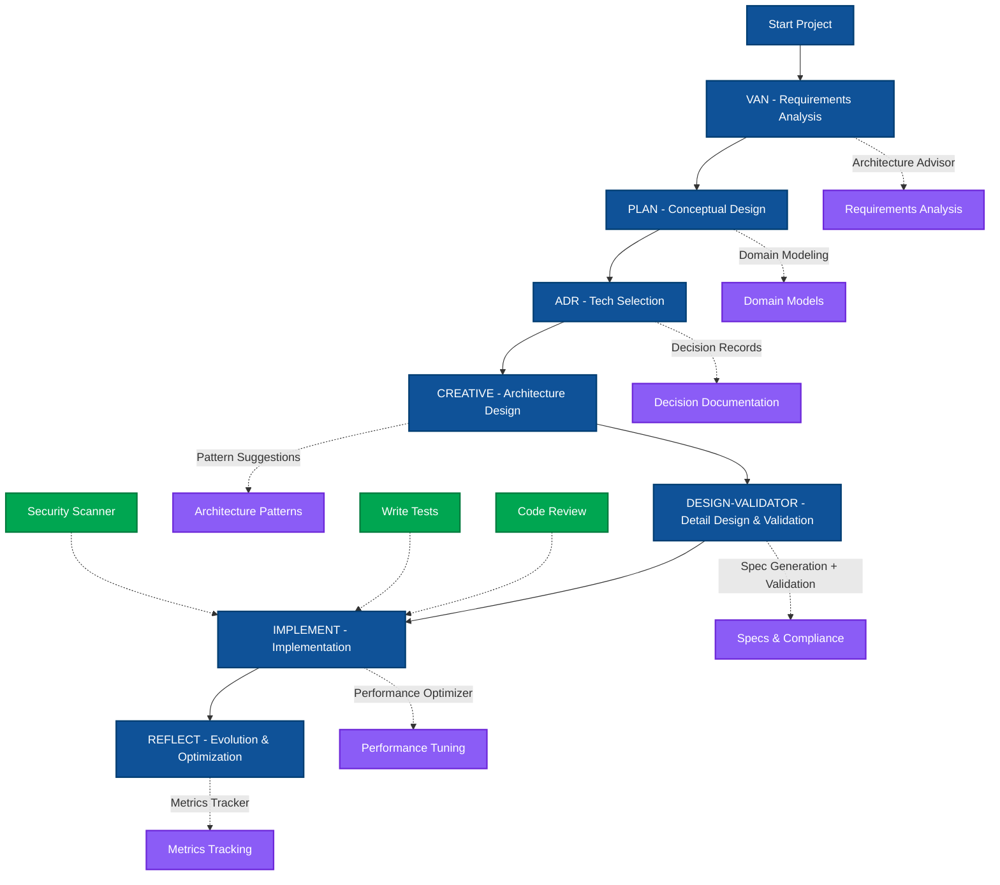

# AI Agentic Coding Template

> **Enterprise-grade architecture workflow for AI-assisted development**
>
> Unified framework for Cursor, Claude Code, and Gemini CLI with Level 4 Architecture Maturity

[](https://opensource.org/licenses/MIT)
[](https://nodejs.org/)
[](#supported-ai-tools)
[](./MATURITY_ASSESSMENT.md)
[](./CONTRIBUTING.md)

## 🚀 Quick Start

```bash
# Clone the repository
git clone https://github.com/yourusername/ai-agentic-coding-template.git
cd ai-agentic-coding-template

# Install dependencies
npm install

# Generate AI tool configurations (choose one or all)
npm run ai-sync           # Generate all: Cursor, Claude Code, Gemini CLI
npm run ai-sync:cursor    # Generate only Cursor configuration
npm run ai-sync:claude    # Generate only Claude Code configuration
npm run ai-sync:gemini    # Generate only Gemini CLI configuration

# Start with your preferred AI tool
# All tools use the same unified commands
/van  # Initialize project with Memory Bank
```

## 📋 Table of Contents

- [Features](#-features)
- [Architecture](#-architecture)
- [Installation](#-installation)
- [Usage](#-usage)
- [Commands](#-commands)
- [Contributing](#-contributing)
- [License](#-license)

## ✨ Features

- **🤖 Multi-AI Support**: Unified commands for three major AI coding assistants
  - **Cursor**: AI-powered IDE with intelligent code completion
  - **Claude Code**: Anthropic's coding assistant with deep reasoning
  - **Gemini CLI**: Google's command-line AI development tool
- **🏗️ Architecture-First**: Seven-step architect-level design workflow
- **🧠 7 AI Agents**: Complete coverage from design to deployment
- **📊 95% Automation**: Spec generation, validation, and compliance checks
- **🔄 Memory Bank**: Persistent context shared across all AI tools and team members
- **🛡️ Enterprise Security**: Built-in security scanning and compliance validation

## 🏗️ Architecture

### Seven-Step Architecture Workflow

Our workflow follows enterprise architecture best practices:

```
/van → /plan → /adr → /creative → /design-validator → /implement → /reflect
```

### Workflow Diagram



## 📁 Project Structure

```
project/
├── .ai/                    # Configuration Center
│   ├── template/          # Templates
│   ├── commands/          # Command definitions
│   ├── agents/           # AI agent configs
│   └── config.yaml       # Main configuration
│
├── memory-bank/           # Shared Memory Bank
│   ├── tasks.md          # Task tracking
│   ├── activeContext.md  # Current context
│   └── progress.md       # Progress tracking
│
├── scripts/              # Build scripts
│   └── sync-ai-config.js # Config synchronization
│
└── [Generated]           # Auto-generated by npm run ai-sync
    ├── .cursorrules      # Cursor configuration
    ├── CLAUDE.md         # Claude Code configuration
    └── GEMINI.md         # Gemini CLI configuration
```

## 🎮 Commands

### Core Workflow Commands

| Command | Purpose | AI Enhancement |
|---------|---------|----------------|
| `/van` | Initialize requirements analysis | Architecture Advisor |
| `/plan` | Conceptual design & task breakdown | Domain Modeling |
| `/adr` | Document architecture decisions | Automated ADR |
| `/creative` | System architecture design | Pattern Suggestions |
| `/design-validator` | Generate specs & validate | 95% Automation |
| `/implement` | Code implementation | Performance Optimizer |
| `/reflect` | Review & optimize | Metrics Tracker |

### Utility Commands

| Command | Purpose | Description |
|---------|---------|-------------|
| `/task-next` | Get PM suggestions | AI-powered task prioritization |
| `/debug` | Smart debugging | Systematic error analysis |
| `/review-code` | Code review | Architecture & quality checks |
| `/write-tests` | Test generation | Automated test creation |
| `/commit` | Git commits | Conventional commit messages |

### NPM Scripts

```bash
# Configuration Management
npm run setup              # Interactive setup wizard
npm run ai-sync            # Generate all AI tool configs
npm run ai-sync:cursor     # Generate Cursor config only
npm run ai-sync:claude     # Generate Claude Code config only
npm run ai-sync:gemini     # Generate Gemini CLI config only
npm run ai-verify          # Verify configuration integrity

# Development
npm test                   # Run test suite
npm run lint              # Code quality checks
```

## 🤖 AI Agents

Our intelligent agent ecosystem provides comprehensive development support:

| Agent | Role | Automation |
|-------|------|------------|
| **Architecture Advisor** | Technical decisions & patterns | 85% |
| **Design Validator** | Spec generation & validation | 95% |
| **Performance Optimizer** | Performance monitoring & optimization | 85% |
| **Security Scanner** | Security & compliance checks | 95% |
| **Code Reviewer** | Code quality & best practices | 80% |
| **Test Runner** | Automated testing & coverage | 90% |
| **Metrics Tracker** | Development metrics & insights | 90% |

## 💡 Usage Examples

### Team Collaboration

```bash
# Alice starts with Cursor
/van      # Initialize project
/plan     # Create task breakdown

# Bob continues with Claude Code
# (Memory Bank automatically syncs context)
/creative # Design architecture
/implement # Start coding

# Charlie reviews with Gemini CLI
/reflect  # Generate progress report
```

### Solo Development

```bash
# Complete workflow example
/van                    # Understand requirements
/plan                   # Design domain model
/adr database-choice    # Document DB decision
/creative               # Design system architecture
/design-validator       # Generate API specs
/implement              # Code with AI assistance
/reflect               # Review and optimize
```

## 🔧 Configuration

### Customizing Workflows

Edit templates in `.ai/template/`:
- `CLAUDE.md` - Claude Code behavior
- `GEMINI.md` - Gemini CLI behavior
- `.cursorrules` - Cursor rules

### Adding Custom Commands

Create new command definitions in `.ai/commands/`:
```yaml
# .ai/commands/workflow/custom.md
---
name: custom
description: Your custom command
phase: workflow
---
```

## 🤝 Contributing

We welcome contributions! Please see our [Contributing Guide](./CONTRIBUTING.md) for details.

### How to Contribute

1. Fork the repository
2. Create your feature branch (`git checkout -b feature/AmazingFeature`)
3. Commit your changes (`git commit -m 'Add some AmazingFeature'`)
4. Push to the branch (`git push origin feature/AmazingFeature`)
5. Open a Pull Request

### Development Setup

```bash
# Clone your fork
git clone https://github.com/yourusername/ai-agentic-coding-template.git
cd ai-agentic-coding-template

# Install dependencies
npm install

# Run tests
npm test

# Run linter
npm run lint
```

### Code of Conduct

Please read our [Code of Conduct](./CODE_OF_CONDUCT.md) before contributing.

## 📚 Documentation

### Core Documentation
- [Architecture Overview](./architecture-diagram.md) - System architecture diagrams
- [AI Workflow Guide](./AI_WORKFLOW.md) - Detailed workflow documentation
- [Configuration Reference](./.ai/config.yaml) - Main configuration file

### AI Agent Documentation
- [Architecture Advisor](./.ai/agents/architecture-advisor.md) - Technical decisions & patterns
- [Design Validator](./.ai/agents/design-validator.md) - Spec generation & validation
- [Performance Optimizer](./.ai/agents/performance-optimizer.md) - Performance optimization
- [Security Scanner](./.ai/agents/security-scanner.md) - Security & compliance
- [Code Reviewer](./.ai/agents/code-reviewer.md) - Code quality checks
- [Test Runner](./.ai/agents/test-runner.md) - Automated testing
- [Metrics Tracker](./.ai/agents/metrics-tracker.md) - Development metrics

## 🌟 Support

- **Issues**: [GitHub Issues](https://github.com/yourusername/ai-agentic-coding-template/issues)
- **Discussions**: [GitHub Discussions](https://github.com/yourusername/ai-agentic-coding-template/discussions)
- **Wiki**: [Project Wiki](https://github.com/yourusername/ai-agentic-coding-template/wiki)

## 📄 License

This project is licensed under the MIT License - see the [LICENSE](./LICENSE) file for details.

## 🙏 Acknowledgments

- Thanks to all contributors who have helped shape this project
- Inspired by enterprise architecture best practices
- Built with ❤️ for the developer community

---

**Made with 🤖 by the AI-Assisted Development Community**