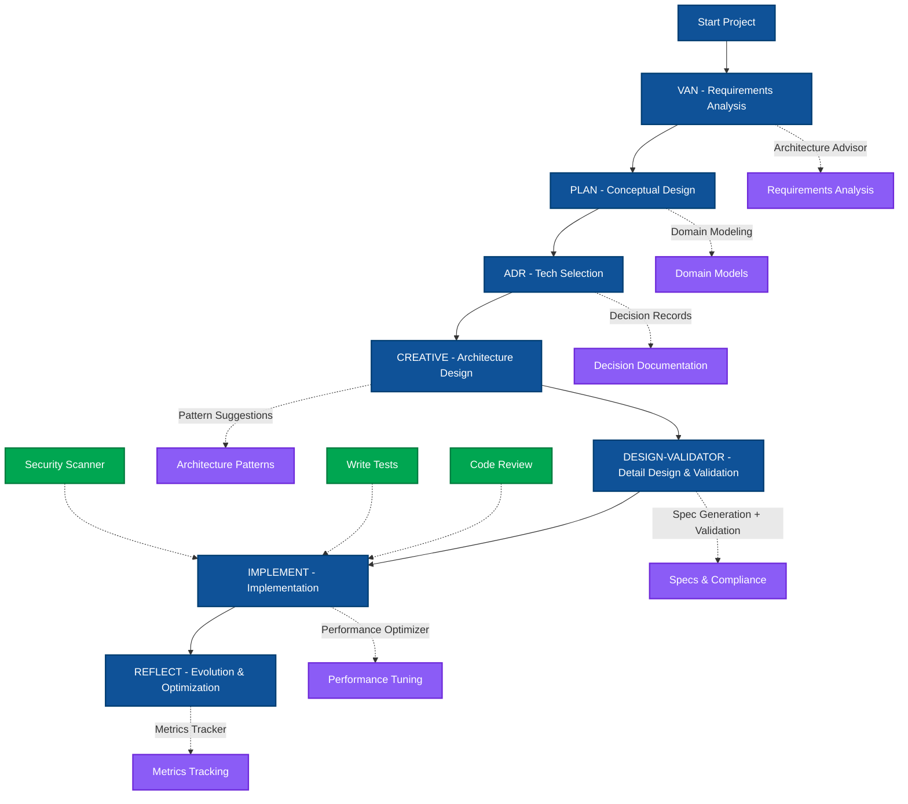

## 桑尼核彈火神銃一波流
# 🚀 Universal AI Copilot Template

> **Enterprise-grade architecture workflow for AI-assisted development**

A unified, production-ready template for integrating AI assistants (Cursor, Claude Code, and Gemini CLI) into your development workflow. This template provides a single source of truth for AI configurations with automatic synchronization and format conversion.

## ✨ Features

- **🔄 Unified Configuration**: Single source of truth in `.ai/` directory
- **🎯 Multi-Tool Support**: Cursor, Claude Code, and Gemini CLI
- **🔧 Automatic Format Conversion**: Markdown to TOML for Gemini
- **📂 Structured Commands**: Organized in system/utility/workflow categories
- **🧠 Memory Bank**: Persistent knowledge base for project context
- **🛡️ Built-in Safeguards**: Hooks and skills for safe AI operations
- **📦 Zero Configuration**: One command setup


### Directory Structure

```
.ai/                    # Source of Truth
├── adapters/          # Tool-specific configurations
│   ├── claude-code/   # Claude agents, hooks, skills
│   ├── cursor/        # Cursor rules and settings
│   └── gemini-cli/    # Gemini converters
├── commands/          # Universal command definitions
│   ├── system/        # Git, PR, deployment commands
│   ├── utility/       # Debug, review, test commands
│   └── workflow/      # Plan, implement, creative commands
└── template/          # Configuration templates

Generated Directories (by npm run init):
.claude/               # Claude Code runtime config
.cursor/               # Cursor runtime config
.gemini/               # Gemini CLI runtime config (TOML)
memory-bank/           # Project knowledge persistence
```

## 📦 Installation

### Quick Start (Recommended)

```bash
# Clone the template
git clone https://github.com/Zenobia000/ai-agentic-coding-template_unified.git
cd ai-agentic-coding-template_unified

# One command initialization (for first time setup)
npm run init
```

This will:
1. Install all dependencies (`npm install`)
2. Generate tool configurations (`.claude/`, `.cursor/`, `.gemini/`)
3. Convert commands to appropriate formats (TOML for Gemini)
4. Create Memory Bank structure
5. Set up all hooks and safeguards

### Manual Setup

```bash
# Install dependencies only
npm install

# Sync configurations after modifying .ai/ directory
npm run ai-sync          # Sync all tools
npm run ai-sync:cursor   # Sync Cursor only
npm run ai-sync:claude   # Sync Claude Code only
npm run ai-sync:gemini   # Sync Gemini CLI only
```

### When to Use Which Command?

| Command | Purpose | Use Case |
|---------|---------|----------|
| `npm run init` | **Full initialization** | • First time setup<br>• After cloning repository<br>• Fresh start |
| `npm run ai-sync` | **Update configurations** | • After modifying `.ai/` contents<br>• Daily development<br>• No need to reinstall packages |
| `npm run ai-sync:[tool]` | **Update specific tool** | • When only changing one tool's config<br>• Faster than full sync |

## 🔄 Seven-Step Architecture Workflow

The template implements a proven enterprise architecture workflow:



### 1️⃣ **VAN** - Requirements Analysis (`/van`)
- Understand and validate requirements
- Identify constraints and dependencies
- Define success criteria
- Output: `memory-bank/requirements/`

### 2️⃣ **PLAN** - Task Planning (`/plan`)
- Break down requirements into tasks
- Prioritize and sequence work
- Identify technical approaches
- Output: Structured task list

### 3️⃣ **ADR** - Architecture Decisions (`/adr`)
- Document key technical decisions
- Evaluate trade-offs
- Record rationale
- Output: `memory-bank/decisions/`

### 4️⃣ **CREATIVE** - Design Solutions (`/creative`)
- Generate innovative approaches
- Explore alternatives
- Design system architecture
- Output: `memory-bank/designs/`

### 5️⃣ **DESIGN-VALIDATOR** - Validate Design (`/design-validator`)
- Review against requirements
- Check architectural compliance
- Validate technical feasibility
- Output: `memory-bank/validation/`

### 6️⃣ **IMPLEMENT** - Build Solution (`/implement`)
- Execute implementation plan
- Follow coding standards
- Apply best practices
- Output: `memory-bank/implementation/`

### 7️⃣ **REFLECT** - Review & Optimize (`/reflect`)
- Assess implementation quality
- Identify improvements
- Update documentation
- Output: `memory-bank/metrics/`

### 📊 Workflow Example

```bash
# Start a new feature
/resume          # Load project context
/van            # Analyze requirements
/plan           # Create task breakdown
/adr            # Document architecture decisions
/creative       # Design solution
/design-validator # Validate approach
/implement      # Build the feature
/reflect        # Review and optimize
```

## 🎯 Universal Commands

All tools share the same command set, organized by category:

### System Commands (`/system`)
- `/commit` - Generate commit messages
- `/pr` - Create pull requests
- `/resume` - Load project context
- `/ship` - Deploy to production
- `/start` - Start new feature branch

### Utility Commands (`/utility`)
- `/adr` - Create Architecture Decision Records
- `/debug` - Systematic debugging
- `/design-validator` - Validate design decisions
- `/review-code` - Comprehensive code review
- `/task-next` - Get next task recommendation
- `/write-tests` - Generate test strategies

### Workflow Commands (`/workflow`)
- `/archive` - Archive completed work
- `/creative` - Creative problem solving
- `/implement` - Implementation guidance
- `/plan` - Task planning
- `/van` - Requirements analysis

## 🧠 Memory Bank

The Memory Bank provides persistent project context:

```
memory-bank/
├── requirements/      # Project requirements
├── decisions/        # Architecture Decision Records
├── metrics/          # Performance metrics
├── designs/          # Design documents
├── validation/       # Validation reports
└── implementation/   # Implementation guides
```

## 🔧 Configuration

### Customizing Commands

Edit command definitions in `.ai/commands/`:

```yaml
# .ai/commands/system/commit.md
---
name: "Commit"
description: "Generate high-quality commit message"
tools:
  cursor:
    trigger: "/commit"
  claude-code:
    trigger: "/commit"
  gemini-cli:
    trigger: "/commit"
---
```

### Adding New Commands

1. Create command file in appropriate category:
   ```bash
   .ai/commands/utility/my-command.md
   ```

2. Run sync to propagate:
   ```bash
   npm run ai-sync
   ```

### Tool-Specific Features

#### Claude Code
- **Agents**: AI sub-agents for complex tasks
- **Hooks**: Event-triggered scripts
- **Output Styles**: Response formatting
- **Skills**: Auto-triggered protections

#### Cursor
- **Rules**: Coding standards and patterns
- **Principles**: AI behavior guidelines
- **Testing**: Test generation rules

#### Gemini CLI
- **TOML Format**: Automatic MD to TOML conversion
- **Converters**: Format transformation utilities

## 🛡️ Safety Features

### Built-in Protections
- **Repo Guard**: Prevents dangerous git operations
- **Branch Protection**: No direct commits to main
- **Command Validation**: Validates commands before execution
- **Sensitive Data Protection**: Prevents credential exposure

### Hooks (Claude Code)
- `tool-use-before`: Pre-execution validation
- `tool-use-after`: Post-execution cleanup
- `user-prompt-submit`: Input validation

## 🔄 Updating

To update the template with latest changes:

```bash
# Pull latest changes
git pull origin main

# Re-sync configurations
npm run ai-sync
```

## 📁 Project Structure

```
.
├── .ai/                 # Source configurations
├── scripts/
│   ├── sync-ai-config.js    # Main sync script
│   ├── template-generator.js # Template processor
│   └── publish.js           # NPM publisher
├── docs/                # Documentation
├── package.json        # Project configuration
└── README.md          # This file
```

## 🤝 Contributing

1. Fork the repository
2. Create your feature branch (`git checkout -b feature/amazing-feature`)
3. Commit your changes (`git commit -m 'feat: add amazing feature'`)
4. Push to the branch (`git push origin feature/amazing-feature`)
5. Open a Pull Request

## 📝 License

MIT License - see LICENSE file for details

## 🔗 Links

- [GitHub Repository](https://github.com/Zenobia000/ai-agentic-coding-template_unified)
- [Issue Tracker](https://github.com/Zenobia000/ai-agentic-coding-template_unified/issues)
- [Documentation](https://github.com/Zenobia000/ai-agentic-coding-template_unified/tree/main/docs)

## 💡 Tips

1. **First Time**: Use `npm run init` for complete setup (installs packages + syncs configs)
2. **Daily Work**: Use `npm run ai-sync` after modifying `.ai/` contents (no package install needed)
3. **Backup**: Use `npm run backup` before major changes
4. **Memory Bank**: Keep your Memory Bank updated for better AI context
5. **Custom Commands**: Add project-specific commands in `.ai/commands/`
6. **Tool Selection**: Use tool-specific sync (e.g., `npm run ai-sync:cursor`) for faster updates

## 🚨 Breaking Changes (Latest)

- Old init scripts removed - use `npm run init` instead
- Memory Bank now generated by `ai-sync`
- Gemini commands now in TOML format (automatic conversion)
- Simplified command structure from 15 to 9 npm scripts
- Removed 6 obsolete scripts for cleaner codebase

---

Built with ❤️ for the AI-assisted development community