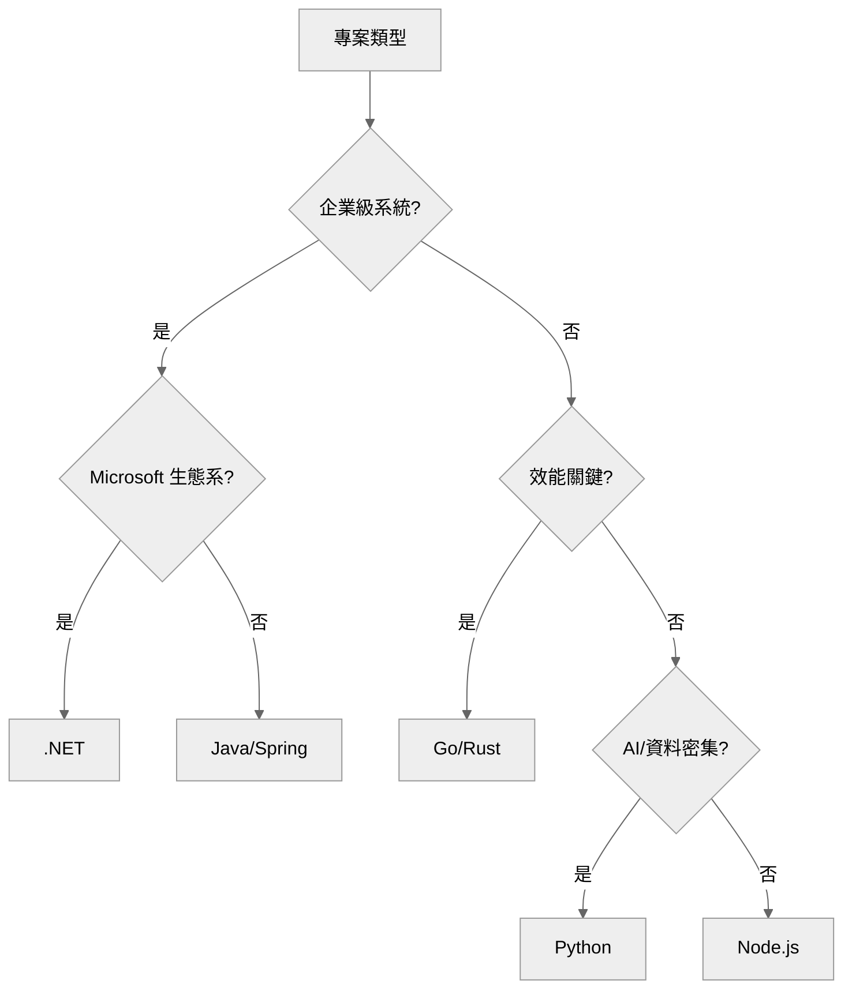
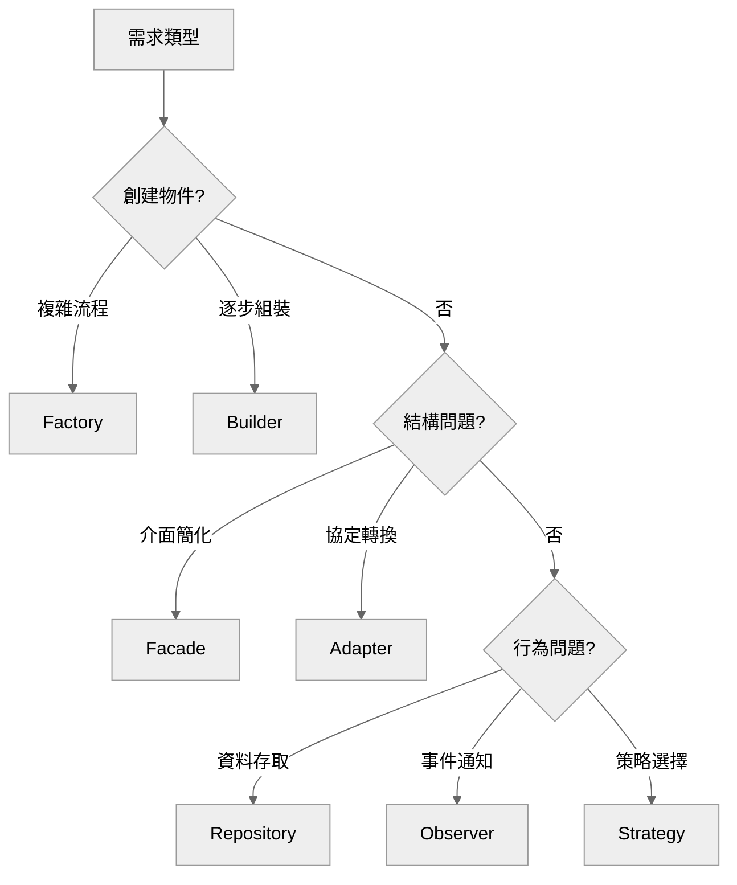
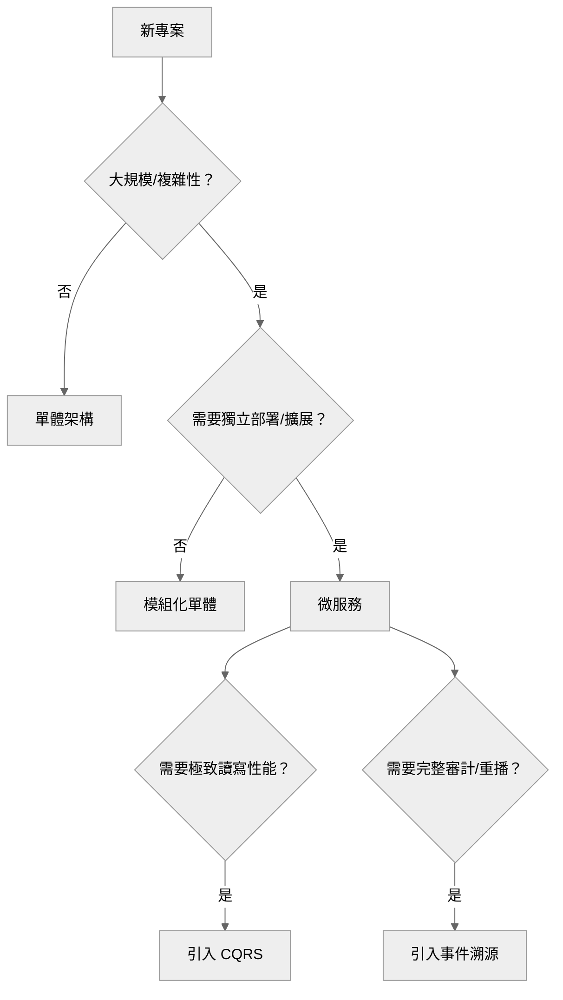

<link rel="stylesheet" href="print_style.css">

<div id="toc"></div>


<div style="page-break-after: always;"></div>


# 桑尼資料科學版權所有，翻譯必究

# 軟體架構精通 - 快速索引

## 🎯 核心內容目錄

### 📚 第一部分：架構基礎
*   **[第一章：架構師的角色與價值](#chapter01)** - 從執行者到決策者的思維躍遷
*   **[第二章：需求分析與量化思維](#chapter02)** - 將 "要快" 轉化為 "P95 < 200ms"
*   **[第三章：架構流程與應用類型](#chapter03)** - 建立可重複的設計標準與流程

### 🔧 第二部分：技術決策
*   **[第四章：技術堆疊選擇與資料策略](#chapter04)** - 基於 TCO 與商業價值的理性選型
*   **[第五章：品質屬性 - 架構的健康指標](#chapter05)** - 量化效能、擴展性與可維護性
*   **[第六章：組件架構與設計模式](#chapter06)** - AI 時代的精確溝通語言

### 🏗️ 第三部分：系統設計
*   **[第七章：系統架構宏觀視角](#chapter07)** - 分散式系統的五大生存支柱
*   **[第八章：進階架構模式](#chapter08)** - 微服務、事件溯源與 CQRS 的核武器庫

### 🎯 第四部分：真實應用
*   **[第九章：案例研究與約束條件](#chapter09)** - 在時間、預算與技能限制下尋求最優解
*   **[第十章：軟技能與專業生存](#chapter10)** - 掌握無權威影響力與衝突管理

---

> 💡 **需要詳細導讀？** 請參閱書末的 **[附錄：架構師實戰手冊](#appendix)**，內含詳細的學習藍圖、讀者指南與延伸資源。


<div style="page-break-after: always;"></div>

<div id="preface"></div>

# 前言：改變規則的遊戲

## 為什麼現在讀這本書？

當 GitHub Copilot 能在幾秒鐘內生成完整的函式，當 ChatGPT 能幫你設計 API 架構，軟體工程師的價值在哪裡？

答案很殘酷，也很清晰：**在剩下的 20%**。

*   AI 可以寫出完美的程式碼，但它無法回答：「**該寫哪段程式碼來賺錢？**」
*   AI 可以優化算法效能，但它無法決定：「**該優化哪個部分來影響業務？**」
*   AI 可以生成測試案例，但它無法判斷：「**該測試什麼來降低風險？**」

這 20%，正是軟體架構師在 AI 時代不可替代的核心價值。

## 從工程師到架構師

這不是一本教你寫程式碼的書，而是一本教你 **「何時不該寫程式碼」** 的書。

從工程師轉型為架構師，意味著從「執行者」變成「決策者」，從「How」的專家變成「Why」的守護者。這個轉變，需要的不僅是技術能力的提升，更是思維模式的根本重塑。

**準備好了嗎？讓我們開始這段從工程師到架構師的蛻變之旅。**

<div class="back-to-top" align="right"><a href="#toc">⬆️ 回到目錄</a></div>


<div style="page-break-after: always;"></div>

<div id="chapter01"></div>


<div style="page-break-after: always;"></div>

# 第一章：架構師的角色與價值定位

## 引言：AI時代的架構師價值
*TL;DR: AI 能自動化 80% 的編碼，但無法替代 20% 的關鍵架構決策。*

> "AI 能寫出完美的函式，但無法決定該寫哪個函式來賺錢"

在人工智慧快速發展的今天，GitHub Copilot、ChatGPT等工具已能完成80%的編碼工作。許多開發者開始焦慮：我們的價值在哪裡？答案就在剩下的 **20%——架構決策**。這正是架構師在AI時代不可替代的價值所在。

---

## 1.1 架構師的核心價值主張
*TL;DR: 從技術實現者轉型為商業價值與技術之間的翻譯官。*


*圖 1-1：架構師價值金字塔 - 從底層代碼實現到頂層商業價值的躍遷*

### 決策權重大於編碼能力
架構師是系統的 **"Why" 守護者**。當開發團隊專注於 "How" 時，架構師必須不斷追問：
- **為什麼** 要建造這個系統？
- **為什麼** 選擇這個技術棧？
- **為什麼** 採用這種架構模式？

每個 "Why" 背後都連結著 **商業價值**。
> 💡 **Insight:** Netflix 在 2008 年全面轉向雲端，並非出於技術狂熱，而是預見到串流媒體的爆發，選擇了 **彈性擴展 > 成本優化**。

### 商業翻譯大於技術實現
架構師是商業語言與技術語言之間的翻譯官。
- **CEO 需求**："我們要提升用戶體驗"
- **架構師翻譯**：
    - 頁面載入時間 3s → 1s
    - API 響應時間 P99 < 200ms
    - 系統可用性 99.9% → 99.99%

### 全局思維大於局部優化
開發者看到的是樹，架構師看到的是整片森林。
- **短期成本 → 長期收益**：微服務初期增加複雜度，但實現了團隊自主性。
- **局部性能 → 整體韌性**：單個服務可能不是最優，但整體系統更加穩定。
- **技術債務 → 業務速度**：知道何時償還債務，何時為了速度暫時容忍。

---

## 1.2 從開發者到架構師的思維轉變
*TL;DR: 從專注於「如何做」到關注「該不該做」與「機會成本」。*


*圖 1-2：思維模式轉變矩陣 - 開發者與架構師的關注點對比*

### 實際案例：抖音推薦系統的架構思考
當面對 "設計一個支撐 10 億日活用戶的推薦系統" 時：

- **開發者思維 (How)**：
    - 最新深度學習框架 → 優化算法 → 提高準確率。
- **架構師思維 (Why/Should)**：
    - **商業目標**：用戶停留時間 +20%。
    - **系統約束**：預算 $10M/年，延遲 < 100ms。
    - **技術權衡**：實時個性化 **vs** 預計算緩存。
    - **風險管理**：降級策略、A/B 測試框架。

---

## 1.3 架構師的職業發展路徑
*TL;DR: 技能複利效應讓架構師越老越值錢，且具備極高的職涯彈性。*


*圖 1-3：架構師薪資成長曲線 - 2025 年市場數據預測*

### 三大職業價值支柱
1.  **策略影響力**：直接參與公司技術戰略，定義技術標準。
2.  **職涯彈性**：可橫向發展為 CTO、VP Engineering 或技術合夥人。
3.  **技能複利效應**：經驗積累帶來的溢價遠高於純編碼崗位。

---

## 1.4 架構師的組織定位
*TL;DR: 處於組織中心，處理 360 度利益相關者的複雜需求。*


*圖 1-4：360 度利益相關者管理 - 架構師在組織中的中心紐帶位置*

### 關鍵溝通策略
- **向上管理 (Executive)**：商業價值導向，量化技術決策的 ROI。
- **橫向協作 (Cross-team)**：促進理解，建立共同技術語言，推動決策透明。
- **向下賦能 (Team)**：提供方向，培養架構思維，建立學習型文化。

---

## 1.5 AI時代的架構師能力模型
*TL;DR: 商業思維與系統思考是 AI 無法替代的核心競爭力。*

```
技術深度 ████████░░ 80%  - 保持技術敏銳度
商業思維 ██████████ 100% - 價值驅動決策
溝通協作 █████████░ 90%  - 跨部門影響力
AI應用   ████████░░ 80%  - 工具賦能設計
系統思考 ██████████ 100% - 全局優化視角
領域知識 ███████░░░ 70%  - 產業洞察力
```

> 💡 **東大式總結**：
> **AI 能做的**：代碼生成、方案選項、文檔草稿。
> **架構師必做的**：定義邊界、評估風險、平衡需求、關鍵決策。

---

## 🎯 本章核心回顧 (Key Takeaways)

1.  **角色轉換**：架構師不是寫代碼最快的人，而是 **"知道什麼代碼不該寫"** 的人。
2.  **核心公式**：`技術深度 + 商業思維 + 溝通能力 = 架構影響力`。
3.  **價值定位**：架構師是商業價值的技術翻譯官，負責將模糊願景轉化為可執行的技術指標。
4.  **AI 現實**：在 Copilot 時代，**"判斷力"** 的價值遠高於 "生產力"。

---

## ⚔️ 實戰思考 (Battle Scenarios)

1.  **場景模擬**：如果 CEO 突然要求增加一個可能導致系統不穩定的新功能，你會如何從「商業價值」與「架構風險」兩個角度與他溝通？
2.  **自我審查**：審視你當前的項目，列出三個最近的技術決策，並試著用 **"為什麼這能幫公司賺錢或省錢"** 的語言重新描述它們。
3.  **邊界思考**：AI 工具能在多大程度上替代你的日常設計？有哪些決定是你絕對不敢交給 AI 做的？

---

## 🔗 延伸連結
- [Neal Ford: Software Architecture: The Hard Parts](https://www.oreilly.com/library/view/software-architecture-the/9781492086888/)
- [Fundamentals of Software Architecture - Mark Richards](https://fundamentalsofsoftwarearchitecture.com/)
- [The Software Architect Elevator - Gregor Hohpe](https://architectelevator.com/)

---

*下一章預告：《第二章：需求分析與量化思維》- 從"系統要很快"到"P95延遲<200ms"的精準轉換藝術*

<div class="back-to-top" align="right"><a href="#toc">⬆️ 回到目錄</a></div>


<div style="page-break-after: always;"></div>

<div id="chapter02"></div>


<div style="page-break-after: always;"></div>

# 第二章：需求分析與量化思維

## 引言：從模糊願景到精準指標
*TL;DR: 架構師的職責是將客戶的「願望」轉化為系統的「承諾」。*

> "客戶說『要很快』是願望，架構師說『100ms內』是承諾"

在架構設計中，最大的挑戰往往不是技術實現，而是理解真正的需求。量化思維是區分優秀架構師與普通開發者的關鍵。

---

## 2.1 商業目標與系統需求的本質區別
*TL;DR: 商業目標 (Why) 驅動系統需求 (What)，架構師負責橋接兩者。*


*圖 2-1：需求轉化漏斗 - 從抽象願景到具體技術指標的過濾過程*

### 核心定義對比
| **維度** | **商業目標 (Goals)** | **系統需求 (Requirements)** |
| :--- | :--- | :--- |
| **定義** | 對組織的影響 (ROI) | 系統該做什麼 (Functions) |
| **指標** | 營收、成本、市場佔有率 | 延遲、吞吐量、可用性 |
| **頻率** | 穩定 (1-3 年) | 多變 (1-6 個月) |

> 💡 **Insight:** 真正的目標通常不是「建立一個系統」，而是「解決一個業務痛點」。
> **錯誤需求**：建立指紋辨識系統。
> **正確目標**：降低代打卡率 90% → 解決方案可能是指紋，也可能是人臉或流程改進。

---

## 2.2 非功能性需求 (NFR) 的量化工程
*TL;DR: 拒絕形容詞！每個形容詞背後都必須對應一個精確的數字。*


*圖 2-2：NFR 五大維度儀表板 - 系統健康的關鍵量化指標*

### NFR 五大核心指標 (The Big 5)
1.  **效能 (Performance)**：P95/P99 延遲、吞吐量 (TPS)。
2.  **負載 (Load)**：併發用戶數 × 請求頻率 → **峰值規劃 = 正常負載 × 10 (預期倍數) × 1.5 (安全係數)**。
3.  **資料量 (Data Volume)**：5 年內的數據增長模型。
4.  **可用性 (Availability)**：SLA 等級（幾個 9）。
    - 99.9% → 年停機 8.77 小時。
    - 99.99% → 年停機 52.6 分鐘。
5.  **併發 (Concurrency)**：同時在線用戶數 (DAU/10) 及其行為模式。

---

## 2.3 利益相關者溝通策略
*TL;DR: 根據受眾的關注點「翻譯」技術決策。*


*圖 2-3：利益相關者對應矩陣 - 不同角色的價值導向與溝通重點*

### 分眾溝通法
- **對 CEO**：談 **ROI 與風險**。"這個設計確保黑五零當機，保護 2000 萬營收。"
- **對 PM**：談 **速度與體驗**。"微服務能加速交付週期 40%。"
- **對 Ops**：談 **穩定與監控**。"容器化減少 80% 配置錯誤。"

### 談判術：應對「100% 可用性」需求

*圖 2-4：需求談判決策樹 - 如何引導利害關係人進行成本與價值的權衡*

> 💡 **東大式談判術**：不要說「不」，要說「價格」。
> "100% 可用性需要 3 倍預算。99.99% 可省下 200 萬，且只差 52 分鐘。您選哪一個？"

---

## 🎯 本章核心回顧 (Key Takeaways)

1.  **量化思維**：每個模糊的形容詞都是架構風險。**數字 = 承諾**。
2.  **漏斗法則**：願景 → 目標 → 指標。不跳步，不假設。
3.  **SLA 成本論**：可用性每增加一個 9，成本通常增加 10 倍。
4.  **翻譯職責**：架構師是技術與商業間的 **「價值翻譯機」**。

---

## ⚔️ 實戰思考 (Battle Scenarios)

1.  **情境題**：用戶說「搜尋功能反應太慢」，你作為架構師，第一步會收集哪三個數據指標？
2.  **成本題**：如果公司只有 10 萬預算，但 PM 要求 99.99% 的可用性，你會如何重新拆解這個需求？
3.  **擴展題**：你的系統目前支撐 1 萬用戶，如果老闆說下個月有大促銷，預期流量成長 10 倍，你如何用數學公式算出所需的資源餘量？

---

## 🔗 延伸連結
- [Google SRE Book: Service Level Objectives](https://sre.google/sre-book/service-level-objectives/)
- [Designing Data-Intensive Applications - Martin Kleppmann](https://dataintensive.net/)
- [The Art of Capacity Planning - Arun Kejariwal](https://www.oreilly.com/library/view/the-art-of/9781449377526/)

---

*下一章預告：《第三章：架構流程與應用類型》- 從需求到實現的可重複工程流程*

<div class="back-to-top" align="right"><a href="#toc">⬆️ 回到目錄</a></div>


<div style="page-break-after: always;"></div>

<div id="chapter03"></div>


<div style="page-break-after: always;"></div>

# 第三章：架構流程與應用類型

## 引言：架構的系統化工程
*TL;DR: 優秀的架構來自於嚴謹、可重複、可預測的工程流程，而非藝術創作。*

> "架構設計不是藝術創作，是可重複、可預測的工程流程"

本章將揭示 Amazon、Google 等公司成功的秘密：一套經過實戰檢驗的架構流程方法論。

---

## 3.1 架構成熟度模型
*TL;DR: 評估組織現狀，從「混沌」走向「創新」。*


*圖 3-1：組織架構成熟度模型 - 從 Level 0 混沌到 Level 4 AI 驅動的演進*

### 關鍵轉化數據
- **Level 0 → 1**：減少 **50%** 重大事故。
- **Level 1 → 2**：降低 **60%** 返工率。
- **Level 2 → 3**：提升 **40%** 交付速度。

---

## 3.2 七步架構設計流程
*TL;DR: 從需求理解到演進優化的標準化生命週期。*


*圖 3-2：七步架構設計生命週期 - 從願景到實現的可持續循環流程*

### 七步流程拆解
1.  **需求理解 (Understand)**：利用 **5W2H** 分析法，將模糊訴求轉為技術指標。
2.  **概念設計 (Conceptualize)**：建立邏輯模型（如 DDD 領域建模），不涉及具體技術。
3.  **技術選型 (Select Tech)**：平衡創新與風險，使用 **TCO 框架** 評估。
4.  **詳細設計 (Design)**：產出 **C4 模型** 藍圖、API 規範與安全方案。
5.  **驗證評審 (Validate)**：執行架構評審（Review），識別可行性風險。
6.  **實施指導 (Guide)**：透過 **Code Review** 與 **示例代碼** 確保架構落地不走偏。
7.  **演進優化 (Evolve)**：基於運行數據（Metrics）持續優化，應用 **絞殺者模式** 處理舊系統。

---

## 3.3 應用類型選擇指南
*TL;DR: 根據業務場景，選擇最合適的應用形態與技術棧。*


*圖 3-3：應用類型決策樹 - 基於用戶需求與技術限制的類型選擇導航*

### 五大類型深度剖析
- **Web 應用**：B2C/SaaS 首選。趨勢：**PWA、微前端**。
- **移動應用**：
    - **原生 (iOS/Swift, Android/Kotlin)**：極致體驗。
    - **跨平台 (Flutter, React Native)**：開發成本 110%-120% 即可換取 90% 體驗。
- **Web API**：微服務間的溝通標準。風格：**REST (60%)、GraphQL (25%)、gRPC (10%)**。
- **後台服務**：處理 ETL、批次作業與異步任務。
- **桌面應用**：**Electron** (生態強) vs **Tauri** (性能好/Rust)。

---

## 3.4 架構決策記錄 (ADR)
*TL;DR: ADR 是組織的「技術記憶」，防止重複犯錯。*


*圖 3-4：ADR 實踐指南 - 良好決策記錄的組成要素與常見反模式對比*

> 💡 **Insight:** 錯誤的決策可以翻案，但「消失的決策原因」會導致系統在重構時崩潰。
> **ADR 核心三要素**：背景 (Context)、決策 (Decision)、後果 (Consequences)。

---

## 🎯 本章核心回顧 (Key Takeaways)

1.  **流程大於個人**：穩定的流程 (Level 2+) 才能產出穩定的架構。
2.  **標準七步法**：`理解 → 概念 → 選型 → 設計 → 驗證 → 指導 → 演進`。
3.  **選型邏輯**：先確定應用類型（Web/Mobile/API），再填入技術細節。
4.  **文檔價值**：ADR 不是負擔，是 **「架構資產」**。

---

## ⚔️ 實戰思考 (Battle Scenarios)

1.  **流程挑戰**：你們團隊目前的設計流程在哪個 Level？如果明天要提升到下一級，最迫切需要建立的「一個規範」是什麼？
2.  **選型決策**：面對一個需要離線工作且對性能要求極高的移動端需求，你會選擇 Native、Flutter 還是 PWA？理由為何？
3.  **ADR 實踐**：回想一個最近被推翻的技術決策，如果當時有寫 ADR，現在能省下多少溝通成本？

---

## 🔗 延伸連結
- [Markdown ADR Tools](https://github.com/npryce/adr-tools)
- [The C4 Model for Software Architecture](https://c4model.com/)
- [ThoughtWorks Technology Radar](https://www.thoughtworks.com/radar)

---

*下一章預告：《第四章：技術堆疊選擇與資料策略》- 如何構建面向未來的技術基礎*

<div class="back-to-top" align="right"><a href="#toc">⬆️ 回到目錄</a></div>


<div style="page-break-after: always;"></div>

<div id="chapter04"></div>


<div style="page-break-after: always;"></div>

# 第四章：技術堆疊選擇與資料策略

## 引言：技術決策的經濟學
*TL;DR: 技術選擇不是追逐潮流，而是基於商業價值、風險與 TCO 的理性權衡。*

> "選錯程式語言成本 50 萬美元，選錯資料庫成本 500 萬美元"

技術決策會隨時間累積複利或債務。本章提供一個系統性框架，幫助架構師跳出「履歷驅動開發 (RDD)」的陷阱。

---

## 4.1 了解總體擁有成本 (TCO)
*TL;DR: 軟體成本像冰山，可見的開發支出僅占 20%，隱藏的維護與債務占 80%。*


*圖 4-1：TCO 冰山模型 - 揭示隱藏在授權、招聘、遷移與技術債後的真實成本*

### 決策公式
- **ROI** = `(商業價值 - TCO) / 轉換成本`。
- **門檻**：當 `當前債務 > 遷移成本 × 1.5` 時，才考慮大重構。

---

## 4.2 2025 年後端技術版圖
*TL;DR: 根據組織文化選擇：企業級求「穩」，敏捷開發求「快」。*


*圖 4-2：後端技術市場圖譜 - 企業級 (Java/.NET) 與敏捷系 (Node/Python/Go) 的定位*

### 技術選擇決策樹


---

## 4.3 資料庫策略：ACID vs BASE
*TL;DR: 資料庫選擇本質上是 CAP 定理的權衡：一致性 vs 可用性。*


*圖 4-3：資料庫選型指南針 - 根據數據結構與一致性需求定位最佳儲存方案*

### 2025 核心選型邏輯
- **關鍵交易 (ACID)**：優先選擇 **PostgreSQL** 或 **MySQL**。
- **海量擴展 (BASE)**：選擇 **Cassandra** 或 **DynamoDB**。
- **高速快取**：必選 **Redis**。

---

## 4.4 技術債務管理
*TL;DR: 技術債不是「壞代碼」，而是「為了短期交付而借的長期貸款」。*


*圖 4-4：技術債務堆疊圖 - 展示利息累積對開發效能的長期衝擊*

### 還債策略 (Payback Strategy)
1.  **20% 原則**：分配 20% 的工程時間處理技術債務。
2.  **絞殺者模式 (Strangler)**：在遺留系統外圍建立新功能，逐步替換。
3.  **大爆破 vs 漸進**：除非生存受威脅，否則拒絕「大爆破式」重寫。

---

## 🎯 本章核心回顧 (Key Takeaways)

1.  **商業優先**：技術服務於業務目標，而非個人興趣。
2.  **隱藏成本**：招聘難度與人才流失是最大的 TCO 變數。
3.  **適才適所**：金錢交易需要 ACID（強一致性），社交數據可接受 BASE（最終一致性）。
4.  **債務透明**：無法量化的技術債務，就是無法管理的風險。

---

## ⚔️ 實戰思考 (Battle Scenarios)

1.  **權衡題**：如果你的團隊全是 Java 背景，但新專案需要極高的併發性能，你會選擇強制推行 Go 語言，還是優化 Java 的非同步框架？理由是什麼？
2.  **預算題**：老闆要求將資料庫從 S3 遷移到一個昂貴的商用資料庫以提高性能，你如何用 TCO 模型證明這項決策是否划算？
3.  **債務題**：列出你當前專案中三個最嚴重的「技術利息」，並為其中一個設計一套「漸進式還款」計畫。

---

## 🔗 延伸連結
- [The Total Cost of Ownership - AWS Guide](https://aws.amazon.com/tco-calculator/)
- [PostgreSQL vs MongoDB: A Decision Guide](https://www.mongodb.com/compare/mongodb-postgresql)
- [Managing Technical Debt - Martin Fowler](https://martinfowler.com/bliki/TechnicalDebt.html)

---

*下一章預告：《第五章：品質屬性 - 架構的健康指標》- 如何定義並測量「好架構」？*

<div class="back-to-top" align="right"><a href="#toc">⬆️ 回到目錄</a></div>


<div style="page-break-after: always;"></div>

<div id="chapter05"></div>


<div style="page-break-after: always;"></div>

# 第五章：品質屬性 - 架構的健康指標

## 引言：功能決定做什麼，品質決定活多久
*TL;DR: 功能需求 (Functional) 是基本功，品質屬性 (Quality Attributes) 才是架構師展現專業的護城河。*

> "功能決定系統『能做什麼』，品質屬性決定系統『能活多久』"

架構的成功不取決於程式碼的華麗，而取決於系統在壓力下是否依然健壯。本章提供一個量化架構品質的系統性框架。

---

## 5.1 架構健康報告卡
*TL;DR: 像醫療監控一樣，使用可量化的指標來定義系統的「生命體徵」。*


*圖 5-1：系統健康評分模型 - 定義效能、擴展性、運維、敏捷與安全的健康基準*

### 核心健康維度
- **🏃 效能健康**：延遲與吞吐量。
- **💪 擴展健身**：成本曲線與彈性係數。
- **🧠 運維智商**：MTTR (平均修復時間) 與監控覆蓋率。
- **🛡️ 安全免疫力**：漏洞修復速度與合規性。

---

## 5.2 擴展性工程：從 1 到 10 億
*TL;DR: 擴展性不是一個按鈕，而是一個隨著用戶成長而不斷演進的階梯。*


*圖 5-2：架構演進階梯 - 從單體 SQLite 到全球分佈式多區域架構的擴展路徑*

### 擴展性的黃金法則
1.  **無狀態設計 (Stateless)**：隨時啟用水平擴展的前提。
2.  **資料分片 (Sharding)**：突破單機寫入瓶頸。
3.  **非同步解耦 (Async)**：利用隊列「削峰填谷」。
4.  **快取一切 (Caching)**：空間換時間，保護數據源。

---

## 5.3 可觀察性與可維護性
*TL;DR: 你無法管理你看不到的東西。監控是 DevOps 的靈魂。*


*圖 5-3：可觀察性演進模型 - 從 L0 (盲目) 到 L4 (AI 驅動根因分析) 的成熟度階段*

### 四個黃金信號 (The 4 Golden Signals)
- **延遲**：響應時間。
- **流量**：每秒請求數。
- **錯誤**：失敗率。
- **飽和度**：資源剩餘容量。

---

## 5.4 品質屬性權衡雷達
*TL;DR: 完美的系統不存在，架構就是「取捨 (Trade-off)」的藝術。*


*圖 5-4：屬性權衡雷達圖 - 金融、社交、遊戲等不同系統類型的品質優先級對比*

> 💡 **Insight:** 提升安全性往往會犧牲效能；提升一致性往往會降低可用性。
> **架構師的職責**：識別出對當前業務 **「最重要的前三名屬性」**，並在其他維度做有意識的妥協。

---

## 🎯 本章核心回顧 (Key Takeaways)

1.  **量化品質**：不要說「系統很穩」，要說「可用性 99.99%，MTTR < 30分鐘」。
2.  **演進思維**：不要為「不存在的規模」過度設計，但要保留「擴展的接口」。
3.  **可觀察性第一**：日誌、指標與追蹤 (LMT) 是系統在生產環境的生命線。
4.  **權衡是正常的**：沒有取捨的架構設計是虛偽的。

---

## ⚔️ 實戰思考 (Battle Scenarios)

1.  **診斷題**：系統響應時間平均 100ms，但 P99 是 2000ms。你會如何診斷這「1% 的痛苦」？
2.  **權衡題**：在設計一個金融轉帳系統時，如果一致性 (Consistency) 與效能 (Performance) 發生衝突，你會如何說服產品經理接受效能的降低？
3.  **擴展題**：假設你的系統目前單機可承載 5000 併發，下個月營收目標是成長 5 倍，請列出你優先會進行的三個擴展性改造動作。

---

## 🔗 延伸連結
- [Google SRE: The Four Golden Signals](https://sre.google/sre-book/monitoring-distributed-systems/)
- [The "-ilities" of Software Architecture](https://en.wikipedia.org/wiki/List_of_system_quality_attributes)
- [Prometheus: Metrics-based Monitoring](https://prometheus.io/docs/introduction/overview/)

---

*下一章預告：《第六章：組件架構與設計模式》- 如何掌握 AI 時代的架構語言？*

<div class="back-to-top" align="right"><a href="#toc">⬆️ 回到目錄</a></div>


<div style="page-break-after: always;"></div>

<div id="chapter06"></div>


<div style="page-break-after: always;"></div>

# 第六章：組件架構與設計模式 - AI時代的語言

## 引言：精確表達，高效協作
*TL;DR: 在 AI 輔助開發時代，設計模式不再只是模板，而是與 AI 溝通的「高階協議」。*

> "告訴AI '使用Repository模式' 比 '從資料庫讀取資料' 精確100倍"

掌握精確的架構詞彙，是實現 AI 協作與永恆系統設計的關鍵。

---

## 6.1 設計模式：AI 的母語
*TL;DR: 模式提供了人類與 AI 之間的共同詞彙，大幅提升代碼生成的準確度。*


*圖 6-1：AI 時代的溝通層級 - 從模糊指令到架構模式的語言進化*

### 效率革命數據 (2025)
- **代碼準確率**：使用模式後提升 **+85%**。
- **開發速度**：提升 **+3.5倍**。
- **錯誤密度**：降低 **-60%**。

---

## 6.2 分層架構：關注點分離
*TL;DR: 現代四層模型是 Clean Architecture 的實踐基礎，確保業務邏輯不受技術棧更迭影響。*


*圖 6-2：現代四層架構模型 - 展示展示層、應用層、領域層與基礎設施層的職責劃分*

### 核心分層規則
1.  **展示層 (Presentation)**：處理 API 與輸入驗證。
2.  **應用層 (Application)**：編排用例，不含業務邏輯。
3.  **領域層 (Domain)**：核心業務規則（POJO/POCO）。
4.  **基礎設施層 (Infrastructure)**：處理 DB、MQ 與第三方整合。
> 💡 **依賴方向法則**：所有依賴必須指向內層（領域層）。內層永遠不應感知外層。

---

## 6.3 SOLID 原則：永恆的基礎
*TL;DR: 違反 SOLID 原則會使代碼複雜度與錯誤率呈指數級上升。*


*圖 6-3：SOLID 視覺導覽 - 用直觀圖標理解可維護程式碼的五大支柱*

### 商業價值指標
- **單一職責 (S)**：減少 **60%** 維護成本。
- **開放/封閉 (O)**：減少 **40%** 新功能開發時間。
- **依賴反轉 (D)**：提升 **90%** 測試覆蓋率。

---

## 6.4 模式選擇決策
*TL;DR: 根據問題場景選擇工具，避免「拿著錘子找釘子」。*



### 架構演進矩陣

*圖 6-4：現代架構模式對比 - 從單體到 Serverless 的適用規模與優劣分析*

---

## 🎯 本章核心回顧 (Key Takeaways)

1.  **模式即協議**：在 Prompt 中明確指定模式，是引導 AI 產出高品質代碼的最佳方式。
2.  **層次分明**：分層不是為了代碼量，而是為了 **「隔離變化」**。
3.  **SOLID 憲法**：違反一個原則會使錯誤密度增加三倍。
4.  **簡單優先**：演進優於革命，模式應從真實需求中自然出現。

---

## ⚔️ 實戰思考 (Battle Scenarios)

1.  **重構題**：你接手了一個 2000 行的「神級類別 (God Object)」，你會優先應用哪三個 SOLID 原則來進行拆解？
2.  **AI 溝通題**：當你要 AI 幫你寫一個支援多種雲存取 (S3, Azure Blob) 的文件上傳組件時，你會如何編寫 Prompt 來引導它使用 Factory 模式？
3.  **權衡題**：在小團隊中實施「六邊形架構 (Hexagonal Architecture)」可能會帶來開發初期的負擔，你如何界定「複雜度」與「靈活性」的轉折點？

---

## 🔗 延伸連結
- [Refactoring Guru: Design Patterns](https://refactoring.guru/design-patterns)
- [Clean Architecture - Robert C. Martin](https://blog.cleancoder.com/uncle-bob/2012/08/13/the-clean-architecture.html)
- [SOLID Principles for AI Engineers](https://www.freecodecamp.org/news/solid-principles-explained-in-plain-english/)

---

*下一章預告：《第七章：系統架構宏觀視角》- 從微觀程式碼到分散式系統生存法則*

<div class="back-to-top" align="right"><a href="#toc">⬆️ 回到目錄</a></div>


<div style="page-break-after: always;"></div>

<div id="chapter07"></div>


<div style="page-break-after: always;"></div>

# 第七章：系統架構宏觀視角 - 分散式系統的生存法則

## 引言：從樹木到森林
*TL;DR: 開發者設計磚塊（程式碼），架構師設計交通流（數據流）。*

> "架構師不設計磚塊（程式碼），他們設計交通流（數據流）"

從程式碼層次轉向系統層次，是架構師職涯中最具挑戰性的轉變。本章將建立分散式系統的五大生存支柱。

---

## 7.1 分散式系統的殘酷現實
*TL;DR: 永遠不要假設網路是可靠的或延遲為零。*

### 視角轉換矩陣
| **維度** | **🔍 微觀視角 (代碼)** | **🔭 宏觀視角 (系統)** |
| :--- | :--- | :--- |
| **關注點** | 類別、函數 | 服務、佇列、快取 |
| **目標** | 代碼正確性 | 系統穩定性、擴展性 |
| **失效影響** | 拋出異常 | 級聯失效 (Cascading Failure) |

---

## 7.2 分散式生存的五大支柱
*TL;DR: 鬆散耦合與無狀態性是實現大規模擴展的唯一路徑。*


*圖 7-1：分散式系統生存支柱 - 支持系統可靠性的核心設計原則*

### 支柱一：鬆散耦合 (Loose Coupling)
- **核心**：組件間無硬編碼依賴。
- **實作**：服務發現、API 閘道、事件匯流排。
- **避免**：共享資料庫、循環依賴。

### 支柱二：無狀態性 (Stateless)
- **核心**：伺服器不儲存用戶 Session。
- **威力**：流量爆發時，可立即水平擴展。
- **實作**：JWT 令牌、外部 Redis 儲存狀態。

### 支柱三：快取策略 (Caching)
- **法則**：用空間換時間。
- **層級**：`瀏覽器 → CDN → 應用快取 → DB 快取`。

### 支柱四：通訊機制 (Communication)
- **同步 (REST/gRPC)**：立即回應，但易產生耦合。
- **非同步 (MQ)**：可靠、解耦，適用於「削峰填谷」。

### 支柱五：可觀測性 (Observability)

*圖 7-2：可觀測性三大支柱 - 指標 (Metrics)、日誌 (Logs) 與追蹤 (Traces)*

---

## 7.3 架構權衡：CAP 定理
*TL;DR: 在 Consistency (一致性)、Availability (可用性) 與 Partition Tolerance (分區容錯) 中三選二。*


*圖 7-3：CAP 定理三角形 - 在分散式網路環境下必然面對的設計取捨*

> 💡 **Insight:** 在網路分區 (P) 必然發生的情況下，架構師通常是在 **CP (如銀行交易)** 與 **AP (如社交媒體)** 之間做選擇。

---

## 🎯 本章核心回顧 (Key Takeaways)

1.  **宏觀優先**：思考服務間的互動，而非單一服務的內部細節。
2.  **無狀態為王**：這是實現 **「無限擴展」** 的物理前提。
3.  **為失效設計**：假設一切都會失效，實施 **斷路器 (Circuit Breaker)** 與 **超時機制**。
4.  **最終一致性**：強一致性很昂貴，學會擁抱 **BASE** 模式。

---

## ⚔️ 實戰思考 (Battle Scenarios)

1.  **故障題**：如果 A 服務同步調用 B 服務，而 B 服務當機了，這會對整個系統產生什麼影響？你如何阻止這種級聯失效？
2.  **擴展題**：你的伺服器目前是「有狀態」的（Session 存在本地），現在需要支援負載平衡，請列出三個重構步驟。
3.  **溝通題**：向業務經理介紹為什麼「訂單顯示延遲 1 秒」是可以接受的（最終一致性），以此換取系統 99.99% 的可用性。

---

## 🔗 延伸連結
- [The Eight Fallacies of Distributed Computing](https://en.wikipedia.org/wiki/Fallacies_of_distributed_computing)
- [Netflix: Mastering Chaos - A Netflix Guide to Microservices](https://www.youtube.com/watch?v=CZ3wIuvmHeM)
- [Microservices Patterns - Chris Richardson](https://microservices.io/patterns/index.html)

---

*下一章預告：《第八章：進階架構模式》- 掌握微服務、事件溯源與 CQRS 的核武器庫*

<div class="back-to-top" align="right"><a href="#toc">⬆️ 回到目錄</a></div>


<div style="page-break-after: always;"></div>

<div id="chapter08"></div>


<div style="page-break-after: always;"></div>

# 第 8 章：進階架構模式 - 複雜問題的特殊解決方案

## 引言：掌握架構模式的核武器庫
*TL;DR: 進階模式（微服務、事件溯源、CQRS）威力強大，但維護成本極高。只有當效益明顯證明複雜度合理時才使用。*

> "這些模式就像核武器：威力強大，但維護成本極高。只有在必要時才使用。"

本章探討如何成功實作分散式系統設計的尖端模式，並揭示其背後的真實成本。

---

## 8.1 複雜性交換定律
*TL;DR: 進階模式不消除複雜性，只是將「代碼複雜性」交換為「分散式複雜性」。*


*圖 8-1：複雜度天平 - 單體代碼複雜性 vs 分散式營運複雜性的平衡取捨*

> 💡 **東大式警告**：**你不是 Google**。除非具備 Google 的規模與運維預算，否則不要輕易引入 Google 的解決方案。

---

## 8.2 微服務架構：獨立性的代價
*TL;DR: 微服務是為了解決組織擴展問題，而非單純的技術升級。*


*圖 8-2：微服務決策導航 - 基於團隊規模與獨立部署需求的轉型路徑*

### 微服務成功的先決條件
- [ ] **快速配置**：基礎設施配置需在分鐘級完成。
- [ ] **全觀監控**：具備跨服務的鏈路追蹤（Tracing）。
- [ ] **DevOps 文化**：團隊需承擔「開發即運維」的責任。

---

## 8.3 事件溯源 (Event Sourcing)
*TL;DR: 記錄「過程（事件）」而非僅僅是「結果（當前狀態）」。*


*圖 8-3：事件溯源流程圖 - 展示狀態如何從一系列不可變事件中衍生而出*

### 範式轉換
- **傳統 CRUD**：`更新 = 覆寫`。數據會丟失，只能看到「屍體」。
- **事件溯源**：`狀態 = 事件重播`。數據永不丟失，能重現「犯罪現場」。

---

## 8.4 CQRS：讀寫責任分離
*TL;DR: 為讀取與寫入設計完全不同的模型，以實現極致效能。*


*圖 8-4：CQRS 架構分解 - 展示命令端（寫入）與查詢端（讀取）的解耦*

### CQRS 甜蜜點
- **讀寫比極端**：如電商產品頁 (1 寫 : 10,000 讀)。
- **複雜 UI 聚合**：需要從多個領域模型中提取數據進行展示。

---

## 8.5 終極決策樹：何時拔劍？
*TL;DR: 優先選擇模組化單體，直到痛苦變得無法忍受。*



---

## 🎯 本章核心回顧 (Key Takeaways)

1.  **複雜性預算**：每個團隊管理複雜性的能力有限，不要超支。
2.  **演進路徑**：`單體 → 模組化單體 → 微服務`。不要從微服務開始。
3.  **模式組合**：`事件溯源 + CQRS` 是最強大的組合，但也最難除錯。
4.  **自主性第一**：微服務的價值在於 **「團隊自主」**，而非技術多樣。

---

## ⚔️ 實戰思考 (Battle Scenarios)

1.  **評估題**：一個 5 人的新創團隊想要為他們的 MVP 採用微服務架構，你會如何勸阻他們？
2.  **設計題**：在金融保險系統中，為什麼「事件溯源」比「傳統資料庫更新」更能應對監管稽核？
3.  **除錯題**：CQRS 帶來的「最終一致性」會導致用戶剛更新完資料卻看不到變更，你會設計什麼樣的 UX 方案來緩解這種焦慮？

---

## 🔗 延伸連結
- [Martin Fowler: Event Sourcing](https://martinfowler.com/eaaDev/EventSourcing.html)
- [Greg Young: CQRS Documents](https://cqrs.files.wordpress.com/2010/11/cqrs_documents.pdf)
- [Microservices patterns: Strangler Fig pattern](https://microservices.io/patterns/refactoring/strangler-fig.html)

---

*下一章預告：《第九章：案例研究與約束條件》- 彌合架構理論與實現現實之間的差距*

<div class="back-to-top" align="right"><a href="#toc">⬆️ 回到目錄</a></div>


<div style="page-break-after: always;"></div>

<div id="chapter09"></div>


<div style="page-break-after: always;"></div>

# 第 9 章：案例研究與約束條件 - 在理論與現實之間取得平衡

## 引言：實驗室 vs. 戰場
*TL;DR: 完美架構只存在於教科書中。在現實世界，約束條件（時間、預算、技能）才是決定架構形狀的真實力量。*

> "架構設計公式：（業務需求 + 數學分析）-（外部約束條件）= 可行架構"

本章透過一個 IoT 平台案例，展示如何將理論藍圖轉化為務實、可部署的解決方案。

---

## 9.1 IoT 案例研究：讓數字說話
*TL;DR: 沒有量化，就沒有設計。透過數學分析識別系統瓶頸。*


*圖 9-1：IoT 系統全景圖 - 展示從感測器採集、邊緣計算到雲端分析的完整數據流*

### 量化分析與架構影響
- **訊息量**：1500 萬條/月 → **高吞吐需求**。
- **併發請求**：平均 5.7 req/s，峰值 570 req/s → **單機不足，需負載平衡**。
- **SLA 要求**：99.99% → **必須消除單點故障 (SPOF)**。

---

## 9.2 解決方案：佇列的藝術
*TL;DR: 佇列 (Queue) 是處理性能與可靠性矛盾的架構英雄。*


*圖 9-2：數學驗證儀表板 - 用於評估不同負載場景下的系統承載能力預測*

> 💡 **Insight:** 直接寫入資料庫會創造極大的延遲風險。
> **重構方案**：`API 接收 → 訊息佇列 (SQS/Service Bus) → 背景處理服務 (Worker) → 批次寫入資料庫`。
> **優點**：實現 **「尖峰削平」** 與 **「異步解耦」**。

---

## 9.3 約束條件：現實的否決權
*TL;DR: 約束條件（時間、技能、預算）往往比功能需求更具決定性。*


*圖 9-3：約束影響矩陣 - 評估預算、時間與團隊技能對技術選型的制約程度*

### 三大關鍵約束
1.  **時間 (Deadline)**：截止日期是第一驅動力。
2.  **技能 (Skills)**：團隊不會 Rust，即便它再快也不該選用。
3.  **營運 (Ops)**：沒人能維護的複雜系統，部署之日就是崩潰之時。

---

## 9.4 從理想到務實：轉換
*TL;DR: 尊重現實是架構師成熟的標誌。*


*圖 9-4：架構天平 - 在「理論完美的解決方案」與「符合約束的可行方案」間取得平衡*

| **維度** | **💭 理想架構** | **🔍 務實架構 (受限後)** | **推理** |
| :--- | :--- | :--- | :--- |
| **訊息傳遞** | Kafka 叢集 | Azure Service Bus | **營運約束**：無 SRE 團隊維護 Kafka。 |
| **開發語言** | Rust | C# / .NET Core | **技能約束**：100% 團隊背景。 |
| **資料庫** | Cassandra | SQL Server | **預算約束**：已有企業授權。 |

---

## 🎯 本章核心回顧 (Key Takeaways)

1.  **量化為先**：先算數學，再畫圖。
2.  **緩衝思維**：面對流量不均，**佇列** 是解決方案的標準答案。
3.  **約束導航**：記錄你的 ADR 時，必須包含 **「因為哪些現實約束而放棄了理想方案」**。
4.  **演進勝過完美**：為今天的約束建造，為明天的擴展留路。

---

## ⚔️ 實戰思考 (Battle Scenarios)

1.  **數學題**：如果系統流量突然增加 10 倍，而資料庫寫入速度是固定的，你的佇列緩衝區可以撐多久？
2.  **現實題**：面對一個 6 週後必須上線的專案，你會選擇團隊熟悉的舊技術，還是具有更高性能但學習曲線 4 週的新技術？
3.  **規劃題**：設計一個「技術升級路徑」，說明當預算增加 3 倍時，你會如何將當前的務實架構升級回理想架構。

---

## 🔗 延伸連結
- [Azure Architecture Center: IoT reference architecture](https://learn.microsoft.com/en-us/azure/architecture/reference-architectures/iot)
- [The Pragmatic Programmer: Your Knowledge Portfolio](https://pragprog.com/titles/tpp20/the-pragmatic-programmer-20th-anniversary-edition/)
- [System Design Primer: Scalability](https://github.com/donnemartin/system-design-primer#scalability)

---

*下一章預告：《第十章：軟技能與專業生存》- 掌握無權威影響力的藝術*

<div class="back-to-top" align="right"><a href="#toc">⬆️ 回到目錄</a></div>


<div style="page-break-after: always;"></div>

<div id="chapter10"></div>


<div style="page-break-after: always;"></div>

# 第 10 章：軟技能與專業生存 - 無權威影響力的藝術

## 引言：技術之外的最終挑戰
*TL;DR: 最完美的架構，如果無法贏得組織的支持，就毫無價值。架構師必須掌握「不靠權威推動決策」的藝術。*

> "架構師通常沒有正式權威。你不能強迫人們聽你的；你必須讓他們想要聽你的。"

從工程師到架構師的躍遷，本質上是從「與機器對話」轉向「與人對話」的過程。

---

## 10.1 孤獨的導航者：無權威的影響力
*TL;DR: 權力來源從「職位」轉向「專家權力」與「參考權力」。*


*圖 10-1：無權威影響力模型 - 核心是建立信任 (Trust) 與專業公信力 (Credibility)*

### 架構師的影響力策略
- **讓他人成功**：當開發團隊因為你的架構減少了加班，你的影響力就會增長。
- **解決真實痛點**：專注於能為業務賺錢或為開發省力的問題。
- **建立價值橋樑**：通過技術方案連接組織中孤立的部門。

---

## 10.2 溝通變色龍：說受眾的語言
*TL;DR: 有效的溝通是翻譯，而非單向傳輸。*


*圖 10-2：利益相關者領域圖 - 標識 CEO、PM 與工程團隊的不同價值領地*

### 語言轉換矩陣
| **受眾** | **🧠 核心關注** | **✅ 有效溝通範例** |
| :--- | :--- | :--- |
| **CEO / Executives** | 💰 利潤與風險 | "這個設計能節省 30% 雲端成本。" |
| **Product Managers** | 📅 時程與範圍 | "這種方法能加速 40% 的新功能上線。" |
| **Dev Teams** | 💻 技術與體驗 | "這能消除 80% 的樣板程式碼。" |

---

## 10.3 衝突解決：專業滅火的藝術
*TL;DR: 批評是改善架構的「免費諮詢」。保持冷靜，用數據說話。*


*圖 10-3：高 EQ 衝突解決工具箱 - 包含積極聆聽、觀點採納與數據驅動的決策技巧*

### 衝突處理公式
1.  **驗證 (Validate)**：承認對方的關注點。"這是一個非常合理的效能擔憂。"
2.  **澄清 (Clarify)**：呈現事實數據。"目前的測試顯示延遲在 100ms 以內。"
3.  **橋接 (Bridge)**：邀請協作。"我們可以離線討論針對極端情況的壓力測試。"

---

## 10.4 職涯演進：從工程師到乘數
*TL;DR: 成功的指標不再是「我完成了什麼」，而是「我讓團隊多完成了什麼」。*


*圖 10-4：架構師技能樹演進 - 展示隨著職位提升，軟技能占比從 10% 提升至 70% 的過程*

> 💡 **Insight:** 終極的架構師是 **「乘數 (Multiplier)」**。
> - **個人貢獻者**：我解決問題。
> - **團隊領導**：我的團隊解決問題。
> - **架構師**：多個團隊因為我的指導，能更高效、更正確地解決問題。

---

## 🎯 本章核心回顧 (Key Takeaways)

1.  **影響力法則**：先助人，再立威。信任是架構師唯一的貨幣。
2.  **翻譯心態**：永遠問自己：「這件事對我面前的這個人有什麼好處？」
3.  **謙遜聆聽**：你不是房間裡最聰明的人，你是那個最能整合智慧的人。
4.  **持續演進**：技術半衰期只有 5 年，軟技能的半衰期卻是終身的。

---

## ⚔️ 實戰思考 (Battle Scenarios)

1.  **政治題**：CTO 與產品副總在技術選型上意見不一，你作為中間的架構師，該如何設計一個能平衡「成本」與「市場速度」的方案來結束爭論？
2.  **情緒題**：一個資深工程師公開嘲諷你的架構設計「過度工程」，你如何在 Code Review 會議上優雅地回應並維持專業尊嚴？
3.  **成長題**：回顧你最近一週的時間分配，有多少百分比是在寫代碼？有多少是在進行溝通與決策？這符合你目前職涯階段的比例嗎？

---

## 🔗 延伸連結
- [The Software Architect Elevator - Gregor Hohpe](https://architectelevator.com/)
- [Influencing Without Authority - Allan Cohen](https://www.wiley.com/en-us/Influencing+Without+Authority%2C+3rd+Edition-p-9781119311027)
- [Managing the Unmanageable - Christopher & Mickey W.](http://www.managingtheunmanageable.net/)

---

*恭喜您完成《架構師武僧寶典》全書學習！願您的架構既有強大的技術骨架，又有溫暖的人性靈魂。*

<div class="back-to-top" align="right"><a href="#toc">⬆️ 回到目錄</a></div>


<div style="page-break-after: always;"></div>

<div id="appendix"></div>

# 附錄：架構師實戰手冊 (Field Manual)

> 這不是一本看完即丟的書，這是一本放在你辦公桌邊的實戰手冊。

本附錄包含本書的詳細使用指南、目標讀者分析以及學習藍圖。當你迷失方向或需要特定指引時，請隨時查閱此處。

---

## 📘 誰應該讀這本書？

| 角色 | 痛點與需求 | 閱讀重點 |
| :--- | :--- | :--- |
| **👨‍💻 資深開發工程師** | 寫得一手好代碼，但對系統全貌感到模糊。想突破純編碼工作。 | Ch 1 (角色), Ch 6 (模式), Ch 7 (系統觀) |
| **🏗️ 初級架構師** | 剛轉型，缺乏系統性的方法論。需要建立從需求到實現的完整思維體系。 | 全書，特別是 Ch 2 (需求), Ch 3 (流程) |
| **👔 技術管理者 (CTO)** | 需要評估架構決策的商業影響，建立技術與業務的對話機制。 | Ch 4 (選型), Ch 9 (約束), Ch 10 (軟技能) |
| **💼 產品經理 (PM)** | 需要理解技術約束對產品的影響，優化產品的技術決策流程。 | Ch 2 (需求), Ch 5 (品質), Ch 10 (溝通) |

---

## 🗺️ 詳細學習藍圖與章節導讀

### 🧠 第一部分：架構基礎 (The Foundation)
*建立正確的思維模型，理解「為什麼」比「怎麼做」更重要。*

| 章節 | 核心主題 | 關鍵產出 | 時間投資 |
| :--- | :--- | :--- | :--- |
| **[第1章：角色與價值](chapter01.md)** | 從 Code 到 Decision 的思維躍遷 | 職業發展路徑圖 | 45 min |
| **[第2章：需求與 SLA](chapter02.md)** | 將模糊願景轉化為數字指標 | NFR 量化儀表板 | 50 min |
| **[第3章：流程與應用](chapter03.md)** | 建立可重複的設計標準 | 架構決策記錄 (ADR) | 55 min |

### 🔧 第二部分：技術決策 (The Decision)
*學會如何在眾多技術選項中，做出最符合商業利益的選擇。*

| 章節 | 核心主題 | 關鍵產出 | 時間投資 |
| :--- | :--- | :--- | :--- |
| **[第4章：選型與數據](chapter04.md)** | TCO 分析與資料庫策略 | 技術評估計分卡 | 60 min |
| **[第5章：品質屬性](chapter05.md)** | 量化系統健康與擴展性 | 架構健康計分卡 | 65 min |
| **[第6章：模式與組件](chapter06.md)** | AI 時代的架構語言 | 模式選擇決策樹 | 55 min |

### 🏗️ 第三部分：系統設計 (The System)
*深入分散式系統的核心，解決大規模擴展的挑戰。*

| 章節 | 核心主題 | 關鍵產出 | 時間投資 |
| :--- | :--- | :--- | :--- |
| **[第7章：宏觀視角](chapter07.md)** | 分散式系統的五大支柱 | 可觀察性實施指南 | 70 min |
| **[第8章：進階模式](chapter08.md)** | 微服務、CQRS 與事件溯源 | 複雜度成本計算器 | 65 min |

### 🎯 第四部分：真實應用 (The Reality)
*回到現實世界，處理約束、政治與人。*

| 章節 | 核心主題 | 關鍵產出 | 時間投資 |
| :--- | :--- | :--- | :--- |
| **[第9章：案例與約束](chapter09.md)** | 在限制中尋求最優解 | 約束分析模板 | 60 min |
| **[第10章：軟技能](chapter10.md)** | 無權威影響力與溝通 | 利害關係人溝通矩陣 | 50 min |

---

## 🛠️ 如何使用這本書

### 1. 針對性閱讀 (Just-in-Time Learning)
不要試圖一次讀完。根據你當前面臨的挑戰選擇章節：
- **要開新專案？** 👉 先讀 Ch 2 (需求) 和 Ch 4 (選型)。
- **系統變慢了？** 👉 直奔 Ch 5 (品質) 和 Ch 7 (系統觀)。
- **推不動決策？** 👉 Ch 10 (軟技能) 是你的救星。

### 2. 實踐優先 (Action First)
每一章末尾都有 **「⚔️ 實戰思考」**。
*   不要只看，要**寫**。
*   拿出你現在負責的系統，試著用書中的模板（如 ADR、NFR 儀表板）填填看。

### 3. 建立你的架構師工具箱
本書提及了大量的工具與模板（ADR、C4 Model、TCO 計算器）。建議你在閱讀過程中，建立一個屬於你自己的 **"Architecture Toolkit"** 資料夾，將這些模板標準化，隨時取用。

---

## 📚 推薦延伸資源

- **必讀經典**：
    - *Software Architecture: The Hard Parts* (Neal Ford)
    - *Designing Data-Intensive Applications* (Martin Kleppmann)
    - *Team Topologies* (Matthew Skelton)
- **線上雷達**：
    - [ThoughtWorks Technology Radar](https://www.thoughtworks.com/radar) (半年一次，必看)
    - [CNCF Landscape](https://landscape.cncf.io/) (雲原生技術地圖)

---

*架構是一場沒有終點的旅程。願這本手冊能成為你背包中最可靠的指南針。*

<div class="back-to-top" align="right"><a href="#toc">⬆️ 回到目錄</a></div>

# 桑尼資料科學版權所有，翻譯必究
