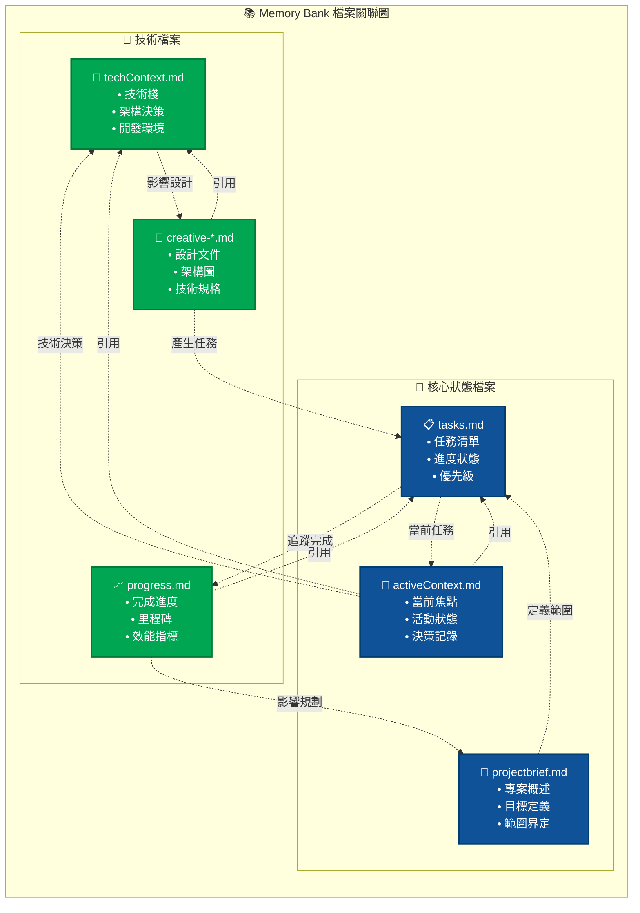
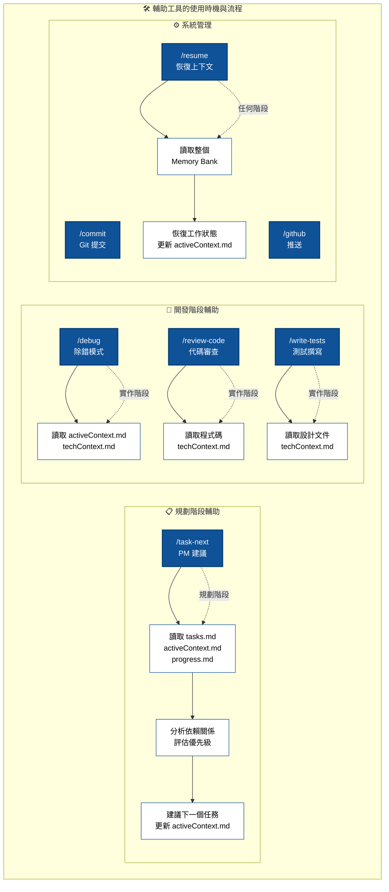

# 🤖 AI 協作工作流程架構關聯圖

## 整體關聯圖譜 - Commands 與 Memory Bank 的關係

```mermaid
graph TB
    %% 用戶層
    subgraph "👤 用戶層 - AI 工具"
        U1[Cursor IDE]
        U2[Claude Code]
        U3[Gemini CLI]
    end

    %% 命令層
    subgraph "⚔️ .ai/commands/ - 指令系統"
        subgraph "🔄 workflow/ - 六階段流程"
            W1["/van<br/>初始化"]
            W2["/plan<br/>規劃"]
            W3["/creative<br/>設計"]
            W4["/implement<br/>實作"]
            W5["/reflect<br/>回顧"]
            W6["/archive<br/>歸檔"]
        end

        subgraph "🛠️ utility/ - 輔助工具"
            UT1["/task-next<br/>PM 建議"]
            UT2["/debug<br/>除錯"]
            UT3["/review-code<br/>代碼審查"]
            UT4["/write-tests<br/>測試撰寫"]
            UT5["/adr<br/>架構決策記錄"]
            UT6["/design-validator<br/>設計驗證器"]
        end

        subgraph "⚙️ system/ - 系統功能"
            S1["/commit<br/>Git 提交"]
            S2["/resume<br/>恢復上下文"]
            S3["/github<br/>推送"]
        end
    end

    %% Memory Bank 層
    subgraph "📚 memory-bank/ - 共享記憶庫"
        M1["📋 tasks.md<br/>任務清單<br/>(Single Source of Truth)"]
        M2["🎯 activeContext.md<br/>當前焦點"]
        M3["📄 projectbrief.md<br/>專案概述"]
        M4["🔧 techContext.md<br/>技術背景"]
        M5["📈 progress.md<br/>進度追蹤"]
        M6["🎨 designs/<br/>設計文件和架構圖"]
        M7["📝 decisions/<br/>架構決策記錄"]
        M8["📊 metrics/<br/>開發指標數據"]
    end

    %% AI 代理層
    subgraph "🧠 AI Agents - Level 4 智能代理"
        A1["🏗️ architecture-advisor<br/>架構建議專家"]
        A2["✅ design-validator<br/>設計驗證和規格生成"]
        A3["📊 metrics-tracker<br/>開發指標追蹤"]
        A4["⚡ performance-optimizer<br/>效能優化專家"]
        A5["🛡️ security-scanner<br/>安全掃描專家"]
        A6["👁️ code-reviewer<br/>代碼審查專家"]
        A7["🧪 test-runner<br/>測試執行專家"]
    end

    %% 工作流程連接
    U1 --> W1
    U2 --> W1
    U3 --> W1

    W1 --> W2 --> W3 --> W4 --> W5 --> W6

    %% Memory Bank 寫入關係
    W1 -.->|"創建/驗證"| M1
    W1 -.->|"初始化"| M2
    W1 -.->|"初始化"| M3

    W2 -.->|"更新任務"| M1
    W2 -.->|"設定焦點"| M2
    W2 -.->|"擴充概述"| M3

    W3 -.->|"添加設計"| M6
    W3 -.->|"技術決策"| M4
    W3 -.->|"更新狀態"| M2

    W4 -.->|"更新進度"| M5
    W4 -.->|"完成任務"| M1
    W4 -.->|"實作焦點"| M2

    W5 -.->|"回顧更新"| M5
    W5 -.->|"經驗記錄"| M2

    W6 -.->|"歸檔整理"| M1
    W6 -.->|"知識保存"| M5

    %% 輔助工具連接
    UT1 -.->|"讀取分析"| M1
    UT1 -.->|"讀取狀態"| M2
    UT1 -.->|"建議更新"| M2

    UT2 -.->|"讀取上下文"| M2
    UT2 -.->|"讀取技術"| M4

    UT3 -.->|"讀取標準"| M4
    UT4 -.->|"讀取規格"| M4

    UT5 -.->|"創建記錄"| M7
    UT5 -.->|"更新決策"| M4

    UT6 -.->|"驗證設計"| M6
    UT6 -.->|"生成規格"| M4

    %% AI 代理連接
    A1 -.->|"架構分析"| M6
    A1 -.->|"決策建議"| M7
    A1 -.->|"技術選型"| M4

    A2 -.->|"設計驗證"| M6
    A2 -.->|"規格生成"| M4
    A2 -.->|"合規檢查"| M7

    A3 -.->|"指標收集"| M8
    A3 -.->|"進度追蹤"| M5
    A3 -.->|"質量分析"| M1

    A4 -.->|"效能監控"| M8
    A4 -.->|"優化建議"| M4
    A4 -.->|"瓶頸分析"| M2

    A5 -.->|"安全掃描"| M6
    A5 -.->|"合規檢查"| M4
    A5 -.->|"風險評估"| M2

    A6 -.->|"代碼分析"| M4
    A6 -.->|"品質報告"| M5

    A7 -.->|"測試執行"| M5
    A7 -.->|"測試報告"| M8

    %% 系統功能連接
    S2 -.->|"恢復狀態"| M1
    S2 -.->|"恢復上下文"| M2
    S2 -.->|"恢復進度"| M5

    %% 麥肯錫風格樣式定義
    classDef workflow fill:#0f5298,stroke:#003d71,stroke-width:2px,color:#ffffff
    classDef utility fill:#00a651,stroke:#007a3d,stroke-width:2px,color:#ffffff
    classDef system fill:#f39200,stroke:#cc7a00,stroke-width:2px,color:#ffffff
    classDef memory fill:#e6e6e6,stroke:#333333,stroke-width:2px,color:#000000
    classDef user fill:#333333,stroke:#000000,stroke-width:2px,color:#ffffff
    classDef agent fill:#8b5cf6,stroke:#6d28d9,stroke-width:2px,color:#ffffff

    class W1,W2,W3,W4,W5,W6 workflow
    class UT1,UT2,UT3,UT4,UT5,UT6 utility
    class S1,S2,S3 system
    class M1,M2,M3,M4,M5,M6,M7,M8 memory
    class U1,U2,U3 user
    class A1,A2,A3,A4,A5,A6,A7 agent
```

## 數據流向詳細分析

```mermaid
flowchart TD
    %% 階段流程數據流
    subgraph "🔄 六階段工作流程數據流"
        START([開始專案])

        subgraph "🚀 VAN 階段"
            VAN_CMD["/van 命令"]
            VAN_CHECK{檢查 Memory Bank}
            VAN_CREATE["創建/修復<br/>memory-bank 結構"]
            VAN_UPDATE["更新<br/>tasks.md<br/>activeContext.md<br/>projectbrief.md"]
        end

        subgraph "📋 PLAN 階段"
            PLAN_CMD["/plan 命令"]
            PLAN_READ["讀取 projectbrief.md"]
            PLAN_CREATE["創建 Epic"]
            PLAN_BREAK["任務分解"]
            PLAN_UPDATE["更新 tasks.md<br/>activeContext.md"]
        end

        subgraph "🎨 CREATIVE 階段"
            CREATIVE_CMD["/creative 命令"]
            CREATIVE_READ["讀取 tasks.md"]
            CREATIVE_DESIGN["架構設計"]
            CREATIVE_TECH["技術決策"]
            CREATIVE_DOC["創建 creative-*.md<br/>更新 techContext.md"]
        end

        subgraph "🔨 IMPLEMENT 階段"
            IMPL_CMD["/implement 命令"]
            IMPL_READ["讀取設計文件"]
            IMPL_CODE["編寫程式碼"]
            IMPL_TEST["執行測試"]
            IMPL_UPDATE["更新 progress.md<br/>完成 tasks.md"]
        end

        subgraph "🪞 REFLECT 階段"
            REFLECT_CMD["/reflect 命令"]
            REFLECT_REVIEW["檢視成果"]
            REFLECT_LEARN["總結經驗"]
            REFLECT_UPDATE["更新 progress.md<br/>activeContext.md"]
        end

        subgraph "📦 ARCHIVE 階段"
            ARCHIVE_CMD["/archive 命令"]
            ARCHIVE_COLLECT["收集文件"]
            ARCHIVE_ORGANIZE["整理知識"]
            ARCHIVE_STORE["歸檔到 Memory Bank"]
        end
    end

    %% 流程連接
    START --> VAN_CMD
    VAN_CMD --> VAN_CHECK
    VAN_CHECK -->|缺失| VAN_CREATE
    VAN_CHECK -->|完整| VAN_UPDATE
    VAN_CREATE --> VAN_UPDATE
    VAN_UPDATE --> PLAN_CMD

    PLAN_CMD --> PLAN_READ
    PLAN_READ --> PLAN_CREATE
    PLAN_CREATE --> PLAN_BREAK
    PLAN_BREAK --> PLAN_UPDATE
    PLAN_UPDATE --> CREATIVE_CMD

    CREATIVE_CMD --> CREATIVE_READ
    CREATIVE_READ --> CREATIVE_DESIGN
    CREATIVE_DESIGN --> CREATIVE_TECH
    CREATIVE_TECH --> CREATIVE_DOC
    CREATIVE_DOC --> IMPL_CMD

    IMPL_CMD --> IMPL_READ
    IMPL_READ --> IMPL_CODE
    IMPL_CODE --> IMPL_TEST
    IMPL_TEST --> IMPL_UPDATE
    IMPL_UPDATE --> REFLECT_CMD

    REFLECT_CMD --> REFLECT_REVIEW
    REFLECT_REVIEW --> REFLECT_LEARN
    REFLECT_LEARN --> REFLECT_UPDATE
    REFLECT_UPDATE --> ARCHIVE_CMD

    ARCHIVE_CMD --> ARCHIVE_COLLECT
    ARCHIVE_COLLECT --> ARCHIVE_ORGANIZE
    ARCHIVE_ORGANIZE --> ARCHIVE_STORE

    %% 麥肯錫風格樣式
    classDef stage fill:#0f5298,stroke:#003d71,stroke-width:2px,color:#ffffff
    classDef action fill:#ffffff,stroke:#0f5298,stroke-width:1px,color:#000000
    classDef decision fill:#f39200,stroke:#cc7a00,stroke-width:2px,color:#ffffff

    class VAN_CMD,PLAN_CMD,CREATIVE_CMD,IMPL_CMD,REFLECT_CMD,ARCHIVE_CMD stage
    class VAN_CREATE,VAN_UPDATE,PLAN_CREATE,PLAN_BREAK,PLAN_UPDATE,CREATIVE_DESIGN,CREATIVE_TECH,CREATIVE_DOC,IMPL_READ,IMPL_CODE,IMPL_TEST,IMPL_UPDATE,REFLECT_REVIEW,REFLECT_LEARN,REFLECT_UPDATE,ARCHIVE_COLLECT,ARCHIVE_ORGANIZE,ARCHIVE_STORE action
    class VAN_CHECK decision
```

## Memory Bank 內部關聯圖

## 輔助工具使用流程

## 關鍵設計原則總結

### 🎯 單一真相來源 (Single Source of Truth)
- **tasks.md** 是所有任務狀態的唯一來源
- 所有命令都從此檔案讀取並更新狀態
- 避免狀態不同步問題

### 🔄 階段式流程 (Phase-based Workflow)
- 六個明確階段，每階段有特定輸入輸出
- 前一階段的產出成為後一階段的輸入
- 確保工作流程的連貫性

### 📚 共享記憶 (Shared Memory)
- Memory Bank 作為所有 AI 工具的共同記憶
- 支持跨工具協作和上下文切換
- 保存專案知識避免流失

### 🛠️ 工具無關性 (Tool Agnostic)
- 相同的命令在所有 AI 工具中有相同效果
- 統一的檔案格式和資料結構
- 無縫的工具切換體驗

這個架構確保了無論使用哪種 AI 工具，都能享受一致的專業級開發體驗！